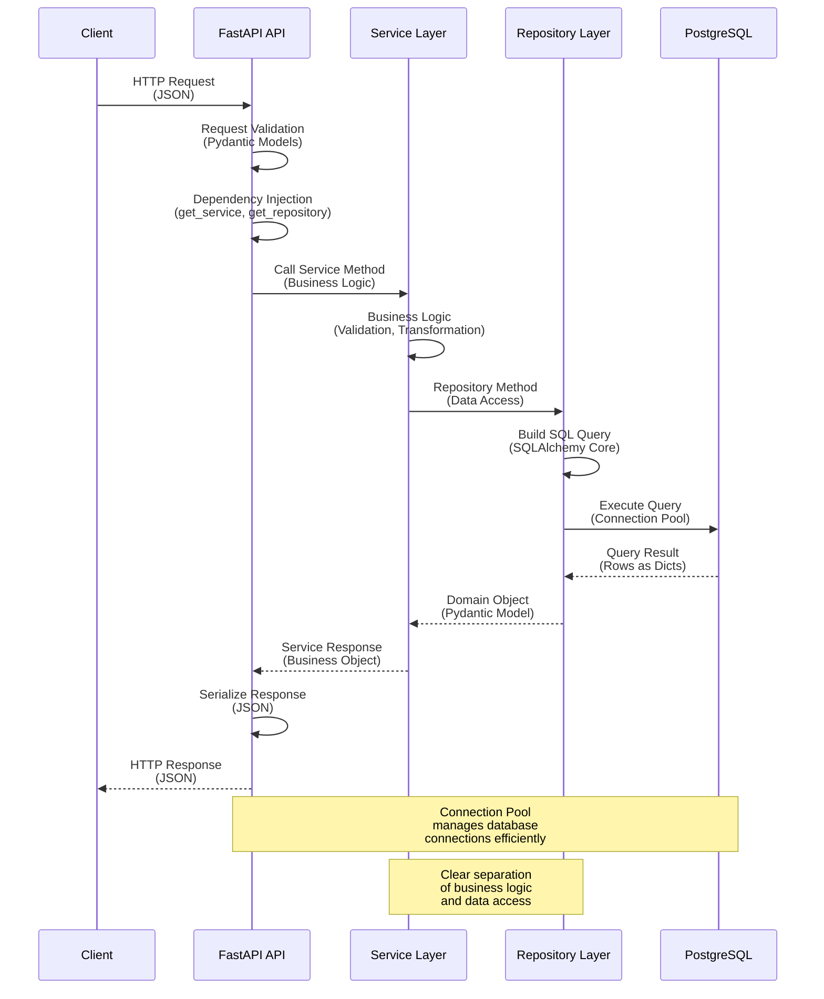

# API Documentation

The Financial Data Extractor provides a comprehensive REST API built with FastAPI for managing companies, documents, financial statement extractions, and compiled statements.

## API Overview

- **Base URL**: `http://localhost:3030/api/v1`
- **API Version**: v1 (URL-based versioning)
- **Format**: JSON
- **Error Format**: RFC 7807 Problem Details

## Interactive Documentation

FastAPI automatically generates interactive API documentation:

- **Swagger UI**: `http://localhost:3030/docs`
- **ReDoc**: `http://localhost:3030/redoc`
- **OpenAPI Schema**: `http://localhost:3030/openapi.json`

## API Request Flow

The following diagram illustrates how a request flows through the API layers from client to database:

**Key Flow Points:**

1. **Request Validation**: FastAPI validates incoming JSON against Pydantic models
2. **Dependency Injection**: Services and repositories are injected via FastAPI's dependency system
3. **Service Layer**: Contains business logic and orchestrates repository calls
4. **Repository Layer**: Encapsulates all database operations using SQLAlchemy Core
5. **Connection Pool**: Manages database connections efficiently (created at startup)
6. **Response Serialization**: Domain objects are automatically serialized to JSON

## Complete API Reference

**[API Reference](reference.html)** - Complete documentation of all endpoints, request/response formats, examples, and error handling.

## API Resources

- **Companies** - Manage company information
- **Documents** - Manage PDF documents (annual reports, presentations)
- **Extractions** - Manage extracted financial statements
- **Compiled Statements** - Manage compiled multi-year financial statements
- **Tasks** - Trigger and monitor Celery tasks

## Authentication

Currently, the API operates without authentication in development. Production deployments should implement OAuth2 with JWT tokens.

## Rate Limiting

No rate limits are currently enforced. Production deployments should implement rate limiting to prevent abuse of expensive operations.

## Monitoring

The API exposes Prometheus metrics at `/metrics` for monitoring request latency, counts, error rates, and more.
