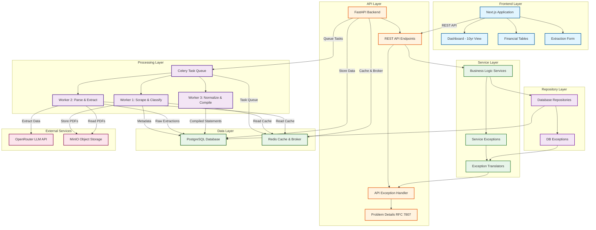

# Architecture Overview

The Financial Data Extractor is built with a modern, scalable architecture that separates concerns and enables independent scaling of components.

## System Architecture

## Architecture Layers

### Frontend Layer
- **Next.js 15** with App Router
- Server Components for initial rendering
- Client Components with React Query for data fetching
- shadcn/ui component library

### API Layer
- **FastAPI** REST API
- Automatic OpenAPI documentation
- RFC 7807 Problem Details for errors
- Request/response validation

### Service Layer
- Business logic separation
- Service exception handling
- Exception translation to API errors

### Repository Layer
- Database abstraction
- SQLAlchemy async operations
- Repository pattern implementation

### Processing Layer
- **Celery** distributed task queue
- Three worker types for different tasks
- Task chaining and workflows

### Data Layer
- **PostgreSQL 16** for structured data
- **Redis** for caching and message broker
- **MinIO** for object storage

## Documentation

- **[Data Flow](data-flow.html)** - Detailed workflow from scraping to compilation
- **[Technology Decisions](technology-decisions.html)** - Why we chose each technology

## Related Documentation

- **[Backend Architecture](../backend/architecture.html)** - Backend implementation details
- **[Frontend Architecture](../frontend/architecture.html)** - Frontend implementation details
- **[Database Schema](../database/schema.html)** - Database structure
- **[Task Processing](../infrastructure/tasks.html)** - Celery task system
