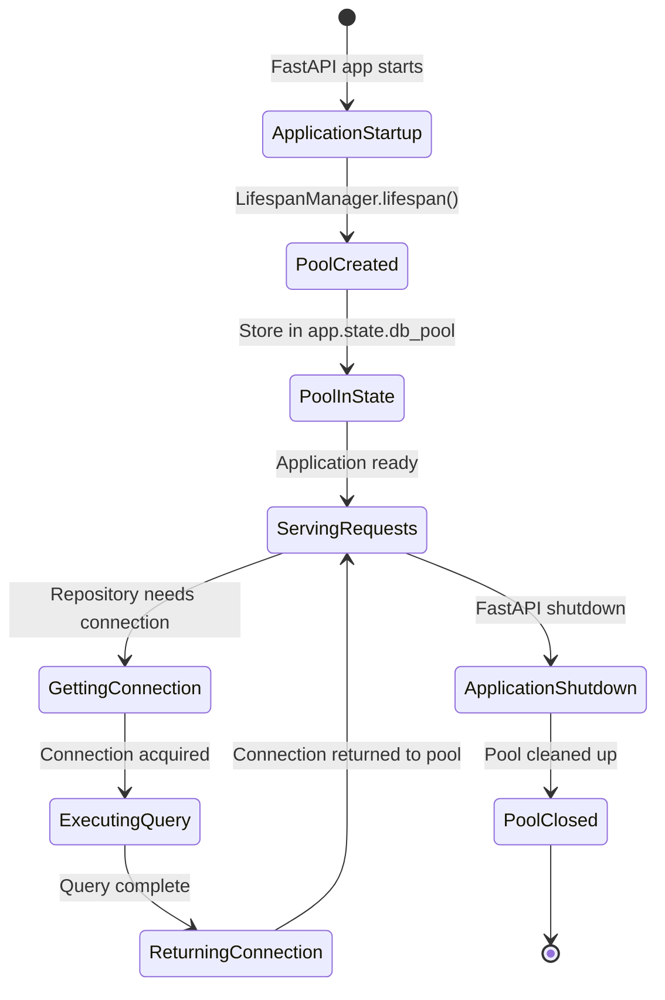

# Backend Architecture

This guide explains the backend architecture of the FastAPI application, covering connection pool management, dependency injection, repository pattern, service layer, and the complete request flow from API endpoints to database operations.

## Architecture Overview

The backend uses a layered architecture with clear separation of concerns:

1. **Application Lifespan** - Manages database connection pool initialization and cleanup
2. **Dependency Injection** - Provides database pool and repositories to endpoints
3. **Repository Layer** - Encapsulates all database operations
4. **Service Layer** - Contains business logic and uses repositories
5. **API Endpoints** - Handle HTTP requests and use services


## Connection Pool Management

### Application Lifespan

The database connection pool is created during application startup and stored in FastAPI's application state. This ensures the pool is available throughout the application's lifetime and properly cleaned up on shutdown.

**Location**: `backend/app/lifespan.py`

The `LifespanManager` class handles the application lifecycle:

```python
@asynccontextmanager
async def lifespan(self, app: FastAPI):
    """Lifespan event handler to initialize and cleanup resources."""
    try:
        settings: Settings = app.state.settings
        
        # URL-encode the database credentials
        db_username = quote_plus(settings.db_username)
        db_password = quote_plus(settings.db_password)
        
        # Construct the database URI
        db_uri = (
            f"postgresql://{db_username}:{db_password}"
            f"@{settings.db_host}:{settings.db_port}/"
            f"{settings.db_name}"
        )
        
        # Create the connection pool
        async with AsyncConnectionPool(
            conninfo=db_uri,
            max_size=20,
            kwargs={"autocommit": True, "row_factory": dict_row}
        ) as pool:
            app.state.db_pool = pool
            self.logger.info("Database connection pool created successfully.")
            yield  # Application runs here
    except Exception as e:
        self.logger.exception("Failed during application lifespan initialization: %s", e)
        raise
    finally:
        self.logger.info("Application is shutting down...")
```

**Key Features:**

- **Connection Pool**: Created with `max_size=20` connections
- **Autocommit**: Enabled for automatic transaction management
- **Row Factory**: Returns rows as dictionaries for easy access
- **Application State**: Pool stored in `app.state.db_pool` for global access
- **Cleanup**: Pool automatically closed when application shuts down

### Pool Configuration

The connection pool is configured with:

- **Maximum Size**: 20 concurrent connections (configurable)
- **Autocommit Mode**: Each query is automatically committed
- **Dictionary Rows**: Query results returned as dictionaries instead of tuples
- **Connection Reuse**: Connections are reused from the pool for better performance

## Dependency Injection Pattern

FastAPI's dependency injection system provides a clean way to access the database pool and repositories throughout the application.

### Database Pool Dependency

**Location**: `backend/app/db/dependencies.py`

The `get_db_pool` function retrieves the connection pool from application state:

```python
async def get_db_pool(request: Request) -> AsyncConnectionPool:
    """Dependency function to get the database connection pool from FastAPI app state.
    
    Args:
        request: FastAPI request object.
        
    Returns:
        Async connection pool for database operations.
        
    Raises:
        RuntimeError: If database pool is not available in app state.
    """
    pool: AsyncConnectionPool | None = getattr(request.app.state, "db_pool", None)
    if pool is None:
        raise RuntimeError("Database connection pool not initialized")
    return pool
```

This function:
- Retrieves the pool from `app.state.db_pool`
- Validates that the pool exists
- Raises a clear error if the pool wasn't initialized

### Repository Dependencies

Repositories are created via dependency injection functions that receive the database pool:

```python
async def get_company_repository(
    db_pool: Annotated[AsyncConnectionPool, Depends(get_db_pool)]
) -> CompanyRepository:
    """Dependency function to get CompanyRepository instance.
    
    Args:
        db_pool: Database connection pool (injected).
        
    Returns:
        CompanyRepository instance.
    """
    return CompanyRepository(db_pool)
```

Each repository has a corresponding dependency function:
- `get_company_repository()`
- `get_document_repository()`
- `get_extraction_repository()`
- `get_compiled_statement_repository()`

### Service Dependencies

Services depend on repositories, which are injected via their dependency functions:

```python
async def get_company_service(
    company_repository: Annotated[
        CompanyRepository, Depends(get_company_repository)
    ],
) -> CompanyService:
    """Dependency function to get CompanyService instance.
    
    Args:
        company_repository: Company repository (injected).
        
    Returns:
        CompanyService instance.
    """
    return CompanyService(company_repository)
```

This creates a dependency chain: **Pool → Repository → Service → Endpoint**

## Repository Pattern

The repository pattern encapsulates all database operations, providing a clean interface for data access.

### Base Repository

**Location**: `backend/app/db/repositories/base.py`

All repositories inherit from `BaseRepository`, which provides common database operations:

```python
class BaseRepository:
    """Base repository providing common database operations using async connection pool."""
    
    def __init__(self, db_pool: AsyncConnectionPool):
        """Initialize repository with database connection pool.
        
        Args:
            db_pool: Async connection pool for database operations.
        """
        self.db_pool = db_pool
```

**Common Methods:**

1. **`execute_query()`** - Execute SELECT queries returning multiple rows
2. **`execute_one()`** - Execute SELECT queries returning a single row
3. **`execute_insert()`** - Execute INSERT queries with RETURNING clause
4. **`execute_update()`** - Execute UPDATE queries
5. **`execute_delete()`** - Execute DELETE queries

**Example - Query Execution:**

```python
async def execute_query(
    self, query: str, params: tuple[Any, ...] | dict[str, Any] | None = None
) -> list[dict[str, Any]]:
    """Execute a SELECT query and return results as list of dictionaries."""
    async with self.db_pool.connection() as conn:
        async with conn.cursor() as cur:
            if params:
                await cur.execute(query, params)
            else:
                await cur.execute(query)
            rows = await cur.fetchall()
            return list(rows)
```

**Key Points:**

- Uses `async with` to get connections from the pool
- Connections are automatically returned to the pool after use
- Parameters are safely escaped to prevent SQL injection
- Returns dictionaries for easy data access

### Concrete Repositories

**Location**: `backend/app/db/repositories/`

Each entity has its own repository class:

- `CompanyRepository` - Company operations
- `DocumentRepository` - Document operations
- `ExtractionRepository` - Extraction operations
- `CompiledStatementRepository` - Compiled statement operations

**Example - CompanyRepository:**

```python
class CompanyRepository(BaseRepository):
    """Repository for managing Company database operations."""
    
    async def get_by_id(self, company_id: int) -> dict[str, Any] | None:
        """Get company by ID."""
        query = "SELECT * FROM companies WHERE id = %(id)s"
        return await self.execute_one(query, {"id": company_id})
    
    async def create(
        self,
        name: str,
        ir_url: str,
        primary_ticker: str | None = None,
        tickers: list[dict[str, str]] | None = None,
    ) -> dict[str, Any]:
        """Create a new company."""
        query = """
            INSERT INTO companies (name, ir_url, primary_ticker, tickers)
            VALUES (%(name)s, %(ir_url)s, %(primary_ticker)s, %(tickers)s)
            RETURNING *
        """
        params = {
            "name": name,
            "ir_url": ir_url,
            "primary_ticker": primary_ticker,
            "tickers": json.dumps(tickers) if tickers else None,
        }
        return await self.execute_one(query, params)
```

Repositories provide:
- **Type Safety**: Methods with clear return types
- **SQL Safety**: Parameterized queries prevent SQL injection
- **Consistency**: All repositories follow the same pattern
- **Testability**: Easy to mock for unit testing

## Service Layer

Services contain business logic and use repositories for data access.

**Location**: `backend/app/services/`

**Example - CompanyService:**

```python
class CompanyService:
    """Service for managing company business logic."""
    
    def __init__(self, company_repository: CompanyRepository):
        """Initialize service with repository."""
        self.repository = company_repository
    
    async def get_company(self, company_id: int) -> dict[str, Any]:
        """Get company by ID.
        
        Raises:
            ServiceEntityNotFoundError: If company not found.
        """
        company = await self.repository.get_by_id(company_id)
        if not company:
            raise ServiceEntityNotFoundError(
                entity_name="Company",
                entity_id=company_id
            )
        return company
```

**Service Responsibilities:**

- **Business Logic**: Validation, error handling, transformations
- **Service Exceptions**: Raise domain-specific exceptions (e.g., `ServiceEntityNotFoundError`)
- **Transaction Boundaries**: Coordinate multiple repository calls if needed
- **Data Validation**: Ensure data integrity before persistence
- **Exception Translation**: Service exceptions are automatically translated to API exceptions by exception translators (see Exception Handling section below)

## Exception Handling Architecture

The backend uses a **layered exception handling pattern** where each layer has its own exception types, and exceptions are translated between layers automatically.

### Exception Layers

**1. Database Layer Exceptions** (`app.core.exceptions.db_exceptions`):
- `BaseDatabaseError` - Base exception for all database errors
- `EntityNotFoundError` - Entity not found in database
- `DatabaseIntegrityError` - Constraint violations
- `DatabaseConnectionError` - Connection failures
- `DatabaseTransactionError` - Transaction failures

**2. Service Layer Exceptions** (`app.core.exceptions.service_exceptions`):
- `BaseServiceError` - Base exception for all service errors
- `EntityNotFoundError` - Entity not found (business context)
- `ValidationError` - Business validation failures
- `BusinessLogicError` - Business rule violations
- `ServiceUnavailableError` - Service operation failures

**3. API Layer Exceptions** (`app.core.exceptions.api_exceptions`):
- `ApiError` - Base exception extending FastAPI's `HTTPException`
- `NotFoundError` - 404 Not Found (RFC 7807 Problem Details)
- `BadRequestError` - 400 Bad Request
- `ForbiddenError` - 403 Forbidden
- `InternalServerError` - 500 Internal Server Error

### Exception Translation

Exceptions are automatically translated between layers using translator functions:

**Database → Service Translation:**

```python
from app.core.exceptions.translators import translate_db_exception_to_service

try:
    company = await repository.get_by_id(company_id)
except DbEntityNotFoundError as e:
    # Translate DB exception to service exception
    service_exception = translate_db_exception_to_service(e)
    raise service_exception
```

**Service → API Translation:**

```python
from app.core.exceptions.translators import translate_service_exception_to_api

try:
    company = await company_service.get_company(company_id)
except ServiceEntityNotFoundError as e:
    # Translate service exception to API exception
    translate_service_exception_to_api(e)
    # Function never returns, always raises API exception
```

**Automatic Translation in Endpoints:**

The error handler middleware automatically translates service exceptions:

```python
# API endpoint - exceptions handled automatically
@router.get("/{company_id}")
async def get_company(
    company_id: int,
    company_service: CompanyService,
) -> CompanyResponse:
    # If service raises ServiceEntityNotFoundError,
    # it's automatically translated to NotFoundError (404)
    company = await company_service.get_company(company_id)
    return CompanyResponse(**company)
```

### Exception Flow Diagram


### Benefits of Layered Exceptions

1. **Clear Separation**: Each layer has its own exception types
2. **Type Safety**: TypeScript-like exception handling with proper typing
3. **Automatic Translation**: No manual exception conversion needed
4. **Consistent Error Responses**: All API errors follow RFC 7807 Problem Details format
5. **Testability**: Easy to mock exceptions at each layer
6. **Maintainability**: Changes to error handling isolated to specific layers

## API Endpoints

API endpoints use services via dependency injection.

**Location**: `backend/app/api/v1/endpoints/`

**Example - Companies Endpoint:**

```python
@router.get(
    "/{company_id}",
    response_model=CompanyResponse,
    summary="Get company by ID",
)
async def get_company(
    company_id: Annotated[int, Path(description="Company ID")],
    company_service: Annotated[CompanyService, Depends(get_company_service)],
) -> CompanyResponse:
    """Get a company by ID.
    
    Args:
        company_id: Company ID.
        company_service: Company service (injected).
        
    Returns:
        Company data.
        
    Raises:
        NotFoundError: If company not found (404).
    """
    # Service exceptions are automatically translated to API exceptions
    company = await company_service.get_company(company_id)
    return CompanyResponse(**company)
```

**Endpoint Responsibilities:**

- **HTTP Layer**: Handle request/response formatting
- **Validation**: Validate path/query parameters
- **Schema Conversion**: Convert between Pydantic schemas and dictionaries
- **Error Handling**: Service layer exceptions automatically translated to HTTP responses

## Complete Request Flow

Here's how a complete request flows through all layers:


**Step-by-Step:**

1. **Client Request**: HTTP request arrives at endpoint
2. **Dependency Resolution**: FastAPI resolves dependencies in reverse order:
   - `get_db_pool()` → gets pool from `app.state.db_pool`
   - `get_company_repository()` → creates repository with pool
   - `get_company_service()` → creates service with repository
3. **Business Logic**: Service calls repository method
4. **Database Query**: Repository gets connection from pool and executes query
5. **Response**: Data flows back through layers, transformed at each step
6. **Connection Return**: Connection automatically returned to pool

## Connection Pool Lifecycle



**Key Lifecycle Events:**

1. **Application Startup**: Pool created in lifespan context manager
2. **Request Handling**: Connections borrowed from pool as needed
3. **Connection Reuse**: Connections returned to pool after use
4. **Application Shutdown**: Pool automatically closed by context manager

## Best Practices

### 1. Always Use Dependency Injection

✅ **Good**: Using dependency injection
```python
async def get_company(
    company_service: Annotated[CompanyService, Depends(get_company_service)],
):
    return await company_service.get_company(1)
```

❌ **Bad**: Accessing pool directly
```python
async def get_company(request: Request):
    pool = request.app.state.db_pool
    # Direct database access - breaks separation of concerns
```

### 2. Use Parameterized Queries

✅ **Good**: Safe parameterized query
```python
query = "SELECT * FROM companies WHERE id = %(id)s"
return await self.execute_one(query, {"id": company_id})
```

❌ **Bad**: String formatting (SQL injection risk)
```python
query = f"SELECT * FROM companies WHERE id = {company_id}"
return await self.execute_one(query)
```

### 3. Handle Connections Properly

✅ **Good**: Connection automatically managed
```python
async def execute_query(self, query: str):
    async with self.db_pool.connection() as conn:
        # Connection automatically returned to pool
```

❌ **Bad**: Manually managing connections
```python
conn = await self.db_pool.getconn()
# Risk of connection leak if not properly returned
```

### 4. Repository Methods Should Be Focused

✅ **Good**: Single responsibility
```python
async def get_by_id(self, company_id: int) -> dict | None:
    """Get company by ID."""
    # Single, focused method
```

❌ **Bad**: Multiple responsibilities
```python
async def get_and_validate_company(self, company_id: int):
    """Get company, validate, transform, and log."""
    # Too many responsibilities
```

## Error Handling

### Connection Pool Errors

If the connection pool is not initialized, `get_db_pool()` raises:

```python
RuntimeError: Database connection pool not initialized
```

This typically happens if:
- The application started before the lifespan manager ran
- The pool failed to initialize (e.g., database connection error)

### Database Query Errors

Repositories don't catch database errors - they propagate to services:

```python
async def get_by_id(self, company_id: int) -> dict | None:
    query = "SELECT * FROM companies WHERE id = %(id)s"
    return await self.execute_one(query, {"id": company_id})
    # Database errors propagate to service layer
```

Services handle errors and convert to HTTP exceptions:

```python
async def get_company(self, company_id: int) -> dict[str, Any]:
    company = await self.repository.get_by_id(company_id)
    if not company:
        raise HTTPException(
            status_code=status.HTTP_404_NOT_FOUND,
            detail=f"Company with id {company_id} not found",
        )
    return company
```

## Testing Considerations

### Mocking Repositories

When testing services, mock repositories:

```python
@pytest.fixture
def mock_company_repository():
    return AsyncMock(spec=CompanyRepository)

@pytest.mark.asyncio
async def test_get_company(mock_company_repository):
    mock_company_repository.get_by_id.return_value = {"id": 1, "name": "Test"}
    service = CompanyService(mock_company_repository)
    result = await service.get_company(1)
    assert result["name"] == "Test"
```

### Integration Tests

For integration tests, use a real database connection pool:

```python
@pytest.fixture
async def db_pool():
    pool = AsyncConnectionPool(conninfo=TEST_DB_URI, max_size=5)
    yield pool
    await pool.close()
```

## Related Documentation

- **[Database Schema](../database/schema.html)** - Table structures and relationships
- **[Database Migrations](../database/migrations.html)** - Schema version control
- **[Database Queries](../database/queries.html)** - Useful SQL query examples
- **[Backend Testing](../testing/backend.html)** - Testing database operations
