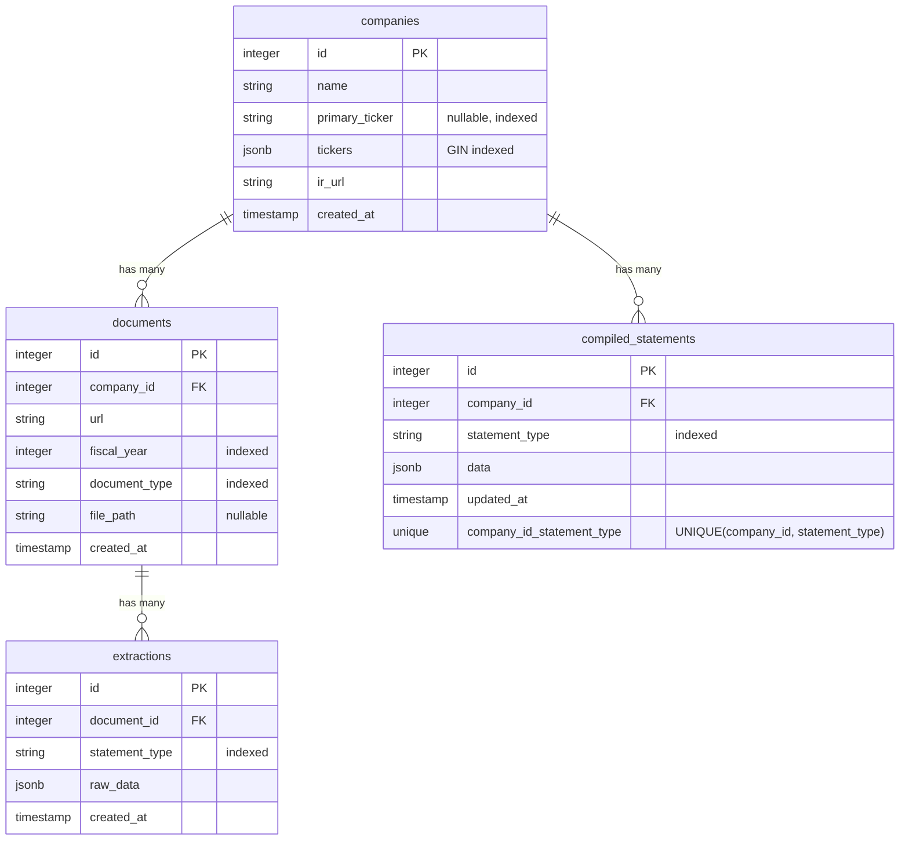

# Database Schema

This guide covers the database schema design, table structures, relationships, and JSONB column formats for the Financial Data Extractor platform.

## Schema Overview

The database consists of four main tables that model the financial data extraction workflow:

1. **companies** - Company information and ticker symbols
2. **documents** - PDF documents (annual reports) downloaded from investor relations websites
3. **extractions** - Raw LLM extraction results from documents
4. **compiled_statements** - Compiled multi-year financial statements

### Entity Relationship Diagram



## Tables Overview

### Companies Table

The `companies` table stores company information including multiple ticker symbols across different exchanges.

```sql
CREATE TABLE companies (
    id INTEGER PRIMARY KEY,
    name VARCHAR NOT NULL,
    primary_ticker VARCHAR(10),  -- Nullable, unique ticker for quick lookups
    tickers JSONB,               -- Array of ticker objects with exchange info
    ir_url VARCHAR NOT NULL,     -- Investor relations URL
    created_at TIMESTAMP WITH TIME ZONE DEFAULT NOW()
);

-- Indexes
CREATE INDEX ix_companies_id ON companies(id);
CREATE INDEX ix_companies_primary_ticker ON companies(primary_ticker);
CREATE INDEX ix_companies_tickers ON companies USING gin(tickers);  -- GIN index for JSONB queries
```

**Columns:**

- `id` - Primary key (auto-increment)
- `name` - Company name (e.g., "AstraZeneca PLC")
- `primary_ticker` - Main ticker symbol (indexed, nullable)
- `tickers` - JSONB array of ticker objects with exchange info (GIN indexed for fast queries)
- `ir_url` - Investor relations page URL
- `created_at` - Timestamp when record was created

**Relationships:**

- Has many `documents`
- Has many `compiled_statements`

### Documents Table

The `documents` table stores metadata about PDF documents downloaded from investor relations websites.

```sql
CREATE TABLE documents (
    id INTEGER PRIMARY KEY,
    company_id INTEGER NOT NULL REFERENCES companies(id) ON DELETE CASCADE,
    url VARCHAR NOT NULL,
    fiscal_year INTEGER NOT NULL,
    document_type VARCHAR(50) NOT NULL,  -- 'annual_report', 'quarterly', etc.
    file_path VARCHAR,                   -- Local file system path
    created_at TIMESTAMP WITH TIME ZONE DEFAULT NOW()
);

-- Indexes
CREATE INDEX ix_documents_id ON documents(id);
CREATE INDEX ix_documents_company_id ON documents(company_id);
CREATE INDEX ix_documents_fiscal_year ON documents(fiscal_year);
```

**Columns:**

- `id` - Primary key
- `company_id` - Foreign key to companies table (CASCADE delete)
- `url` - Source URL of the document
- `fiscal_year` - Fiscal year (e.g., 2024)
- `document_type` - Type of document (indexed)
- `file_path` - Local storage path (nullable)
- `created_at` - Timestamp when document was downloaded

**Relationships:**

- Belongs to `company`
- Has many `extractions`

### Extractions Table

The `extractions` table stores raw LLM extraction results from documents.

```sql
CREATE TABLE extractions (
    id INTEGER PRIMARY KEY,
    document_id INTEGER NOT NULL REFERENCES documents(id) ON DELETE CASCADE,
    statement_type VARCHAR(50) NOT NULL,  -- 'income_statement', 'balance_sheet', 'cash_flow_statement'
    raw_data JSONB NOT NULL,             -- Raw LLM extraction output
    created_at TIMESTAMP WITH TIME ZONE DEFAULT NOW()
);

-- Indexes
CREATE INDEX ix_extractions_id ON extractions(id);
CREATE INDEX ix_extractions_document_id ON extractions(document_id);
CREATE INDEX ix_extractions_statement_type ON extractions(statement_type);
```

**Columns:**

- `id` - Primary key
- `document_id` - Foreign key to documents table (CASCADE delete)
- `statement_type` - Type of financial statement (indexed)
- `raw_data` - JSONB containing raw LLM extraction
- `created_at` - Timestamp when extraction was performed

**Relationships:**

- Belongs to `document`

### Compiled Statements Table

The `compiled_statements` table stores compiled multi-year financial statements aggregated from multiple extractions.

```sql
CREATE TABLE compiled_statements (
    id INTEGER PRIMARY KEY,
    company_id INTEGER NOT NULL REFERENCES companies(id) ON DELETE CASCADE,
    statement_type VARCHAR(50) NOT NULL,
    data JSONB NOT NULL,  -- Compiled multi-year statement data
    updated_at TIMESTAMP WITH TIME ZONE DEFAULT NOW(),
    UNIQUE(company_id, statement_type)  -- One compiled statement per type per company
);

-- Indexes
CREATE INDEX ix_compiled_statements_id ON compiled_statements(id);
CREATE INDEX ix_compiled_statements_company_id ON compiled_statements(company_id);
CREATE INDEX ix_compiled_statements_statement_type ON compiled_statements(statement_type);
```

**Columns:**

- `id` - Primary key
- `company_id` - Foreign key to companies table (CASCADE delete)
- `statement_type` - Type of financial statement (indexed)
- `data` - JSONB containing compiled multi-year statement
- `updated_at` - Timestamp when statement was last updated
- **Unique Constraint**: Only one compiled statement per company per statement type

**Relationships:**

- Belongs to `company`

## Foreign Key Cascades

All foreign keys use `ON DELETE CASCADE`, meaning:

- Deleting a company → deletes all its documents and compiled statements
- Deleting a document → deletes all its extractions

This ensures referential integrity and prevents orphaned records.

## Working with JSONB Columns

PostgreSQL JSONB columns are used to store flexible, schema-less data for extractions, compiled statements, and company tickers. JSONB provides:

- **Fast queries** with GIN indexes
- **Flexible schema** for evolving data structures
- **Rich querying** with JSONB operators and functions

### Company Tickers JSON Structure

Companies can have multiple tickers across different exchanges. The `tickers` JSONB column stores all ticker symbols with their exchange information:

**Single Ticker, Multiple Exchanges:**

```json
[
  {
    "ticker": "AZN",
    "exchange": "LSE"
  },
  {
    "ticker": "AZN",
    "exchange": "NASDAQ"
  }
]
```

**Multiple Tickers, Different Exchanges:**

For companies with different tickers on different exchanges (e.g., Unilever):

```json
[
  {
    "ticker": "ULVR",
    "exchange": "LSE"
  },
  {
    "ticker": "UNA",
    "exchange": "Euronext Amsterdam"
  },
  {
    "ticker": "UL",
    "exchange": "NYSE"
  }
]
```

The `primary_ticker` field stores the main ticker symbol for quick lookups, while `tickers` contains the complete list with exchange information.

### Extractions JSON Structure

The `raw_data` JSONB column in the `extractions` table stores the raw LLM extraction output:

```json
{
  "statement_type": "income_statement",
  "company_name": "Adyen",
  "fiscal_year": 2024,
  "currency": "EUR",
  "line_items": [
    {
      "name": "Total Revenue",
      "values": {
        "2024": 97690,
        "2023": 96773,
        "2022": 91462
      },
      "indentation_level": 0,
      "is_total": true
    },
    {
      "name": "Cost of Revenue",
      "values": {
        "2024": 54321,
        "2023": 51234,
        "2022": 48765
      },
      "indentation_level": 1,
      "is_total": false
    }
  ]
}
```

**Key Fields:**

- `statement_type` - Type of financial statement
- `company_name` - Company name from document
- `fiscal_year` - Primary fiscal year of the statement
- `currency` - Currency code (EUR, USD, etc.)
- `line_items` - Array of financial line items with:
  - `name` - Line item name
  - `values` - Object with year keys and numeric values
  - `indentation_level` - Hierarchical level (0 = top level)
  - `is_total` - Boolean indicating if this is a total/subtotal line

### Compiled Statements JSON Structure

The `data` JSONB column in the `compiled_statements` table stores compiled multi-year statements:

```json
{
  "statement_type": "income_statement",
  "company_name": "Adyen",
  "currency": "EUR",
  "line_items": [
    {
      "name": "Total Revenue",
      "values": {
        "2024": 97690,
        "2023": 96773,
        "2022": 91462,
        "2021": 53823,
        "2020": 31536
      },
      "indentation_level": 0,
      "is_total": true,
      "variants": ["Total Revenue", "Revenues", "Total revenues"]
    }
  ]
}
```

**Key Differences from Extractions:**

- **Multiple years**: `values` object contains data from multiple years (typically 10 years)
- **Variants**: `variants` array contains normalized names for line items (used during fuzzy matching)
- **Restated data**: Values may come from newer reports that restate older years

## Index Strategy

### Primary Indexes

All tables have indexes on:

- Primary key (`id`)
- Foreign keys (`company_id`, `document_id`)
- Frequently queried columns (`fiscal_year`, `statement_type`, `primary_ticker`)

### JSONB Indexes

- **GIN Index on `companies.tickers`**: Enables fast queries on JSONB ticker arrays
- **JSONB columns are queryable** using operators like `@>`, `->`, `->>`

**Example JSONB Queries:**

```sql
-- Find company by ticker in JSONB array
SELECT * FROM companies
WHERE tickers @> '[{"ticker": "AZN"}]'::jsonb;

-- Extract ticker from JSONB
SELECT name, tickers->0->>'ticker' as first_ticker
FROM companies;
```

## Data Relationships

The Mermaid ERD diagram above shows the relationships. Here are the key relationship rules:

**Relationship Rules:**

- Each company can have multiple documents (one-to-many)
- Each document can have multiple extractions (one-to-many, one per statement type)
- Each company has one compiled statement per statement type (one-to-many with unique constraint)
- All foreign keys use `ON DELETE CASCADE` to ensure referential integrity
- Deleting a company cascades to delete all its documents and compiled statements
- Deleting a document cascades to delete all its extractions

## Schema Evolution

The schema is managed through [Database Migrations](migrations.md). All schema changes should:

1. Be created as migrations using `make migrate-create NAME="description"`
2. Be reviewed before applying
3. Be tested on development database first
4. Follow best practices for migrations

## Related Documentation

- **[Database Migrations](migrations.md)** - How to create and apply migrations
- **[Database Queries](queries.md)** - Useful SQL query examples
- **[Infrastructure Development Setup](../infrastructure/development.md)** - Setting up the database
