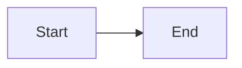

# GitHub Pages Documentation

This guide explains how to develop and deploy the documentation site that's hosted on GitHub Pages. The documentation uses **Jekyll** with the **Just-the-Docs** theme.

## Overview

The documentation site is built with:

- **Jekyll 4.3.3** - Static site generator
- **Just-the-Docs** - Jekyll theme for documentation
- **Ruby** - Runtime for Jekyll and gems
- **Bundler** - Ruby dependency manager
- **GitHub Pages** - Hosting platform

**Live Site**: [https://patrykquantumnomad.github.io/financial-data-extractor/](https://patrykquantumnomad.github.io/financial-data-extractor/)

## Prerequisites

Before developing the documentation locally, you need:

### Required Software

1. **Ruby** (3.0.0 or higher)
   - Check version: `ruby --version`
   - Install: Use `rbenv`, `rvm`, or system package manager
   - **Recommended**: Ruby 3.3.1 or newer

2. **Bundler** (Ruby gem manager)
   - Check version: `bundle --version`
   - Install: `gem install bundler`
   - **Recommended**: Bundler 2.7.2 or newer

### Verify Installation

```bash
ruby --version
# Should output: ruby 3.3.1 (or similar)

bundle --version
# Should output: Bundler version 2.7.2 (or similar)
```

## Project Structure

The documentation is located in the `docs/` directory:

```
docs/
├── _config.yml          # Jekyll configuration
├── Gemfile              # Ruby dependencies
├── Gemfile.lock         # Locked dependency versions
├── index.md             # Home page
├── _includes/           # Reusable components
├── _sass/               # Custom styles
├── assets/              # Images, CSS, JS
└── [sections]/          # Documentation pages
    ├── index.md
    └── [sub-pages].md
```

## Local Development Setup

### 1. Install Dependencies

Navigate to the `docs/` directory and install Ruby dependencies:

```bash
cd docs
bundle install
```

This command:
- Reads `Gemfile` to determine required gems
- Installs Jekyll, Just-the-Docs, and other dependencies
- Creates `Gemfile.lock` to lock versions
- Installs gems to a local bundle (isolated from system gems)

### 2. Start Local Server

Start the Jekyll development server with live reload:

```bash
bundle exec jekyll serve --livereload
```

**Alternative commands:**

```bash
# Without live reload (faster, but requires manual refresh)
bundle exec jekyll serve

# On a specific port
bundle exec jekyll serve --port 4001

# Watch for changes (default)
bundle exec jekyll serve --watch

# Build only (no server)
bundle exec jekyll build
```

### 3. Access Local Site

Once the server starts, you'll see output like:

```
Server address: http://127.0.0.1:4000/financial-data-extractor/
                    ^^^^^^^^^^^^^^^^^^^^^^^^^^^^^^^^^^^^^^^^^^^^
```

Open the URL in your browser. The site automatically reloads when you make changes to Markdown files.

### 4. Stop Server

Press `Ctrl+C` in the terminal to stop the Jekyll server.

## Ruby, Gem, and Bundle Commands

### Ruby Commands

**Ruby** is the programming language Jekyll is built on:

```bash
# Check Ruby version
ruby --version

# Run a Ruby script
ruby script.rb

# Interactive Ruby (IRB)
irb
```

### Gem Commands

**Gems** are Ruby packages. Jekyll and its dependencies are gems:

```bash
# List installed gems
gem list

# Install a gem globally
gem install jekyll

# Uninstall a gem
gem uninstall jekyll

# Update a gem
gem update jekyll

# Search for gems
gem search jekyll

# Show gem information
gem info jekyll
```

**Note**: For this project, we use Bundler to manage gems instead of installing them globally.

### Bundle Commands

**Bundler** manages gem dependencies for a project:

```bash
# Install dependencies from Gemfile
bundle install

# Update all gems to latest versions (updates Gemfile.lock)
bundle update

# Update a specific gem
bundle update jekyll

# Check if dependencies are satisfied
bundle check

# Show installed gems
bundle list

# Show outdated gems
bundle outdated

# Execute a command in the bundle context
bundle exec jekyll serve
```

**Why `bundle exec`?**

- Ensures you use the exact gem versions from `Gemfile.lock`
- Prevents conflicts with globally installed gems
- Always use `bundle exec` for Jekyll commands in this project

## Common Development Tasks

### Adding a New Page

1. Create a new `.md` file in the appropriate directory:
   ```bash
   docs/your-section/new-page.md
   ```

2. Add front matter (YAML header):
   ```yaml
   ---
   layout: default
   title: Page Title
   description: Page description
   nav_order: 1
   parent: Parent Section
   ---
   ```

3. Write content in Markdown
4. The page appears automatically in the navigation

### Editing Navigation

Navigation is controlled by front matter in each page:

- `nav_order`: Determines position in navigation (lower numbers appear first)
- `parent`: Sets parent section (creates hierarchy)
- `has_children: true`: Indicates section has sub-pages

### Adding Diagrams

The site supports Mermaid diagrams:

````markdown

````

See [Mermaid Documentation](https://mermaid.js.org/) for syntax.

### Previewing Changes

1. Make changes to `.md` files
2. Save the file
3. Jekyll automatically rebuilds (watch mode)
4. Browser reloads automatically (with `--livereload`)
5. Check for errors in the terminal

### Troubleshooting Build Errors

**Common Issues:**

1. **Missing dependencies:**
   ```bash
   bundle install
   ```

2. **Outdated gems:**
   ```bash
   bundle update
   ```

3. **Port already in use:**
   ```bash
   bundle exec jekyll serve --port 4001
   ```

4. **Build errors:**
   - Check YAML front matter syntax
   - Verify Markdown links use `.html` extension
   - Check for broken internal links

5. **Clear build cache:**
   ```bash
   rm -rf _site
   bundle exec jekyll build
   ```

## VS Code Tasks

A VS Code task is configured for running Jekyll:

**Task Name:** "Jekyll: Serve"

**Usage:**
1. Open Command Palette (⌘⇧P / Ctrl+Shift+P)
2. Type "Tasks: Run Task"
3. Select "Jekyll: Serve"
4. Task runs in background terminal
5. Documentation available at `http://localhost:4000`

**Configuration:** See [`.vscode/tasks.json`](https://github.com/PatrykQuantumNomad/financial-data-extractor/blob/main/.vscode/tasks.json)

## GitHub Pages Deployment

### Automatic Deployment

Documentation is automatically deployed to GitHub Pages when:

1. Changes are pushed to `main` branch
2. Changes are in the `docs/` directory
3. GitHub Actions workflow runs successfully

**Workflow File:** [`.github/workflows/jekyll-gh-pages.yml`](https://github.com/PatrykQuantumNomad/financial-data-extractor/blob/main/.github/workflows/jekyll-gh-pages.yml)

### Deployment Process

The GitHub Actions workflow:

1. **Triggers** on push to `main` when `docs/**` files change
2. **Checks out** the repository
3. **Sets up Ruby** and installs dependencies
4. **Builds** the Jekyll site (`bundle exec jekyll build`)
5. **Deploys** to GitHub Pages

**Build Output:** `docs/_site/` directory

### Manual Deployment

You can also trigger deployment manually:

1. Go to **Actions** tab in GitHub
2. Select **"Deploy Jekyll site to Pages"** workflow
3. Click **"Run workflow"**
4. Select branch (usually `main`)
5. Click **"Run workflow"**

### Deployment Status

- Check deployment status in **Actions** tab
- View live site: [https://patrykquantumnomad.github.io/financial-data-extractor/](https://patrykquantumnomad.github.io/financial-data-extractor/)
- Deployment typically takes 1-2 minutes

## Configuration Files

### `_config.yml`

Main Jekyll configuration file:

- **Site metadata**: Title, description, email
- **Theme**: Just-the-Docs theme settings
- **Base URL**: `/financial-data-extractor` (GitHub Pages path)
- **Search**: Enabled with custom configuration
- **Mermaid**: Diagram rendering configuration

**File:** [`docs/_config.yml`](https://github.com/PatrykQuantumNomad/financial-data-extractor/blob/main/docs/_config.yml)

### `Gemfile`

Ruby dependencies for the documentation site:

- **Jekyll 4.3.3** - Static site generator
- **just-the-docs** - Documentation theme
- **jekyll-feed** - RSS feed plugin
- **webrick** - Required for Ruby 3.0.0+
- **csv** - Required for Ruby 3.4.0+

**File:** [`docs/Gemfile`](https://github.com/PatrykQuantumNomad/financial-data-extractor/blob/main/docs/Gemfile)

### `Gemfile.lock`

Locked versions of all dependencies. This ensures:

- Consistent builds across environments
- Reproducible deployments
- Version stability

**Important:** Commit `Gemfile.lock` to version control.

## Best Practices

### Documentation Writing

1. **Use Markdown**: Write content in Markdown format
2. **Link Format**: Use `.html` extensions for internal links (e.g., `[Page](page.html)`)
3. **Front Matter**: Always include proper front matter in each file
4. **Navigation**: Use `nav_order` to control page order
5. **Diagrams**: Use Mermaid for visual diagrams

### Version Control

1. **Commit Changes**: Commit Markdown files and configuration
2. **Gemfile.lock**: Always commit `Gemfile.lock`
3. **Test Locally**: Build locally before pushing to catch errors
4. **Review**: Review changes in local build before deployment

### Performance

1. **Optimize Images**: Compress images before adding to `assets/`
2. **Minimize Custom CSS**: Use theme defaults when possible
3. **Clean Builds**: Clear `_site/` directory if experiencing issues

## Troubleshooting

### Ruby Version Issues

**Problem:** Wrong Ruby version or missing Ruby

**Solution:**
```bash
# Install Ruby version manager (rbenv recommended)
brew install rbenv ruby-build

# Install Ruby 3.3.1
rbenv install 3.3.1
rbenv global 3.3.1

# Verify
ruby --version
```

### Bundle Install Fails

**Problem:** `bundle install` fails with errors

**Solution:**
```bash
# Update Bundler
gem update bundler

# Clear gem cache
bundle clean --force

# Try again
bundle install
```

### Jekyll Server Won't Start

**Problem:** Server fails to start or port conflicts

**Solution:**
```bash
# Check if port is in use
lsof -i :4000

# Use different port
bundle exec jekyll serve --port 4001

# Clear build cache
rm -rf _site
bundle exec jekyll serve
```

### Build Errors

**Problem:** Jekyll build fails with errors

**Solution:**
1. Check YAML front matter syntax
2. Verify all links use `.html` extension
3. Check for missing dependencies: `bundle install`
4. Review error messages in terminal
5. Clear build cache: `rm -rf _site`

## Additional Resources

- [Jekyll Documentation](https://jekyllrb.com/docs/)
- [Just-the-Docs Theme](https://just-the-docs.github.io/just-the-docs/)
- [GitHub Pages Documentation](https://docs.github.com/en/pages)
- [Bundler Documentation](https://bundler.io/docs/)
- [Ruby Documentation](https://www.ruby-lang.org/en/documentation/)

## Related Documentation

- [Cursor IDE Configuration](cursor-ide.html) - IDE setup and configuration
- [Getting Started Guide](../getting-started/installation.html) - Project setup
- [Documentation Standards](../architecture/technology-decisions.html) - Documentation best practices
