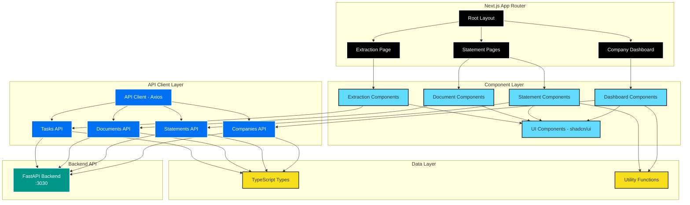

# Frontend Architecture

The Financial Data Extractor frontend is built with **Next.js 15**, **React 19**, and **TypeScript**, providing a modern, type-safe, and performant user interface for viewing and managing financial data extraction.

## Overview

The frontend serves as the primary interface for users to:

- **Browse Companies**: View all companies and navigate to financial statements
- **View Financial Statements**: Display 10-year compiled views of Income Statements, Balance Sheets, and Cash Flow Statements
- **Monitor Documents**: Browse scraped and classified PDF documents by company and fiscal year
- **Trigger Extraction**: Start and monitor Celery tasks for data extraction
- **Real-time Updates**: Monitor task progress with live status polling

## Technology Stack

### Core Framework

- **Next.js 15** - React framework with App Router for Server Components and improved performance
- **React 19** - Latest React features with improved hydration and concurrent rendering
- **TypeScript** - Strict type safety for better developer experience and fewer runtime errors

### Styling & UI

- **Tailwind CSS 4.0** - CSS-first configuration with `@import "tailwindcss"` and `@theme` directive
- **shadcn/ui** - Accessible component library built on Radix UI primitives
- **Lucide React** - Modern icon library

### Data & API

- **Axios** - HTTP client with interceptors for error handling
- **SWR** - Data fetching and caching (available for future optimization)

## Architecture Diagram



## Project Structure

```
frontend/
├── src/
│   ├── app/                          # Next.js App Router pages
│   │   ├── layout.tsx                # Root layout with favicon and global styles
│   │   ├── page.tsx                  # Home page - Company dashboard
│   │   ├── globals.css               # Tailwind CSS and theme variables
│   │   ├── companies/
│   │   │   └── [id]/
│   │   │       └── statements/
│   │   │           └── [type]/
│   │   │               └── page.tsx  # Statement detail page (SSR)
│   │   └── extraction/
│   │       └── page.tsx              # Extraction management page
│   │
│   ├── components/
│   │   ├── ui/                       # shadcn/ui base components
│   │   │   ├── button.tsx
│   │   │   ├── card.tsx
│   │   │   ├── tabs.tsx
│   │   │   ├── badge.tsx
│   │   │   └── table.tsx
│   │   │
│   │   ├── layout/
│   │   │   └── navbar.tsx            # Navigation bar with logo
│   │   │
│   │   ├── dashboard/
│   │   │   └── company-list.tsx      # Company grid with cards
│   │   │
│   │   ├── statements/
│   │   │   ├── statement-view.tsx    # Main statement container
│   │   │   ├── financial-statement-table.tsx  # 10-year data table
│   │   │   ├── statement-type-nav.tsx         # Statement type tabs
│   │   │   └── statement-error.tsx             # Error page component
│   │   │
│   │   ├── documents/
│   │   │   └── document-list.tsx      # Document viewer grouped by year
│   │   │
│   │   └── extraction/
│   │       ├── extraction-controls.tsx        # Trigger extraction tasks
│   │       ├── extraction-page-content.tsx     # Extraction page layout
│   │       └── task-status-monitor.tsx         # Real-time task polling
│   │
│   └── lib/
│       ├── api/                      # API client modules
│       │   ├── client.ts             # Axios instance with interceptors
│       │   ├── companies.ts          # Company CRUD operations
│       │   ├── documents.ts           # Document listing operations
│       │   ├── statements.ts          # Compiled statement retrieval
│       │   └── tasks.ts              # Task triggering and status
│       │
│       ├── types/
│       │   └── index.ts              # TypeScript types matching backend schemas
│       │
│       └── utils/
│           ├── utils.ts              # cn() helper for Tailwind classes
│           └── formatters.ts         # Currency, number, percent formatters
│
├── public/
│   └── images/
│       ├── favicon.ico
│       └── logo.png
│
├── package.json
├── tsconfig.json
├── tailwind.config.ts
├── next.config.js
└── postcss.config.mjs
```

## Page Architecture

### Server Components (Default)

Next.js 15 defaults to Server Components, which run on the server and can directly access databases or APIs:

```typescript
// app/companies/[id]/statements/[type]/page.tsx
export default async function StatementPage({ params }: PageProps) {
  const { id, type } = await params;
  const company = await companiesApi.getById(companyId);
  // Server Component - no "use client" needed
}
```

**Benefits:**

- Smaller client bundle (component code doesn't ship to browser)
- Direct API access without exposing endpoints
- Better SEO (content rendered on server)
- Improved security (secrets can be used on server)

### Client Components (When Needed)

Use `"use client"` directive for interactive components:

```typescript
// components/dashboard/company-list.tsx
"use client";

export function CompanyList() {
  const [companies, setCompanies] = useState<Company[]>([]);
  // Client Component - uses hooks and interactivity
}
```

**When to use:**

- Component uses React hooks (`useState`, `useEffect`, etc.)
- Component handles user interactions (onClick, onChange)
- Component uses browser APIs (localStorage, window)
- Component needs event listeners

## Component Architecture

### Component Hierarchy

```
Root Layout
├── Navbar (Server)
└── Page Content
    ├── Company Dashboard (Client)
    │   └── Company Cards (Client)
    │       └── View Statements Button (Client)
    │
    ├── Statement Page (Server)
    │   └── Statement View (Client)
    │       ├── Statement Type Nav (Client)
    │       ├── Financial Statement Table (Client)
    │       ├── Document List (Client)
    │       └── Extraction Controls (Client)
    │
    └── Extraction Page (Server)
        └── Extraction Page Content (Client)
            ├── Company Selector (Client)
            └── Extraction Controls (Client)
                └── Task Status Monitor (Client)
```

### Key Components

#### Financial Statement Table

The `FinancialStatementTable` component displays 10-year compiled financial data:

**Features:**

- Sticky header row for horizontal scrolling
- Hierarchical line items with indentation levels
- Restated data indicators (badge + asterisk)
- Currency formatting (millions/billions)
- Responsive design with horizontal scroll

**Data Structure:**

```typescript
interface CompiledStatement {
  id: number;
  company_id: number;
  statement_type: string;
  data: {
    lineItems?: Array<{
      name: string;
      "2024": number;
      "2023": number;
      // ... more years
      level?: number;
      isTotal?: boolean;
    }>;
    // OR
    columns?: string[];
    rows?: Array<{ name: string; [year: string]: number }>;
  };
}
```

#### Task Status Monitor

Real-time polling of Celery task status:

```typescript
// Polls every 2 seconds until task completes
useEffect(() => {
  const interval = setInterval(async () => {
    const status = await tasksApi.getTaskStatus(taskId);
    if (status.status === "SUCCESS" || status.status === "FAILURE") {
      clearInterval(interval);
    }
  }, 2000);
}, [taskId]);
```

**Status Handling:**

- PENDING → Clock icon, yellow badge
- STARTED → Spinner, blue badge
- SUCCESS → Check icon, green badge with result
- FAILURE → X icon, red badge with error message
- RETRY → Spinner, orange badge

## API Client Architecture

### Axios Configuration

The API client uses interceptors for consistent error handling:

```typescript
// lib/api/client.ts
export const apiClient: AxiosInstance = axios.create({
  baseURL: `${
    process.env.NEXT_PUBLIC_API_URL || "http://localhost:3030"
  }/api/v1`,
  headers: { "Content-Type": "application/json" },
});

// Error interceptor handles:
// - 404s (logged at debug level, not as errors)
// - Empty error responses ({})
// - Network errors
// - Status-specific error messages
```

### API Modules

Each resource has a dedicated API module:

```typescript
// lib/api/companies.ts
export const companiesApi = {
  getAll: async (): Promise<Company[]> => {
    /* ... */
  },
  getById: async (id: number): Promise<Company> => {
    /* ... */
  },
  create: async (data: CompanyCreate): Promise<Company> => {
    /* ... */
  },
  // ...
};
```

**Benefits:**

- Type-safe API calls
- Centralized error handling
- Easy to mock for testing
- Consistent request/response patterns

## Styling Architecture

### Tailwind CSS 4.0

**CSS-First Configuration:**

```css
/* src/app/globals.css */
@import "tailwindcss";

@theme {
  --radius: 0.5rem;
}

@layer base {
  :root {
    --background: 0 0% 100%;
    --foreground: 222.2 84% 4.9%;
    /* ... shadcn/ui CSS variables */
  }
}
```

**Key Features:**

- No `tailwind.config.js` needed (CSS-first)
- Automatic content detection
- Built-in CSS nesting support
- `@theme` directive for custom tokens

### shadcn/ui Components

Components are installed directly into the codebase (not via npm):

```typescript
// components/ui/button.tsx
import { cva, type VariantProps } from "class-variance-authority";
import { cn } from "@/lib/utils";

const buttonVariants = cva(
  "inline-flex items-center justify-center rounded-md text-sm font-medium",
  {
    variants: {
      variant: {
        default: "bg-primary text-primary-foreground",
        outline: "border border-input bg-background",
        // ...
      },
      size: { default: "h-10 px-4", sm: "h-9", lg: "h-11" },
    },
  }
);
```

**Benefits:**

- Full control over component code
- Easy customization
- Type-safe variants with CVA
- Consistent with Tailwind utilities

## Error Handling

### API Error Interceptor

```typescript
// Handles empty responses, 404s, network errors
apiClient.interceptors.response.use(
  (response) => response,
  (error) => {
    if (error.response?.status === 404) {
      // Log at debug level, not as error
      // 404s are expected for missing resources
    }
    // Extract meaningful error messages
    // Attach status code for component handling
  }
);
```

### Error Pages

**Statement Error Component** handles three scenarios:

1. **Company Not Found (True 404)**: Company doesn't exist in database
2. **Statements Not Generated**: Company exists, but statements haven't been extracted yet
3. **API Connection Issues**: Backend server down or network problems

**Smart Detection:**

```typescript
// If company found in list but API returns 404,
// treat as "statements not generated" not "company not found"
const statementsNotGenerated = is404 && companyName;
```
