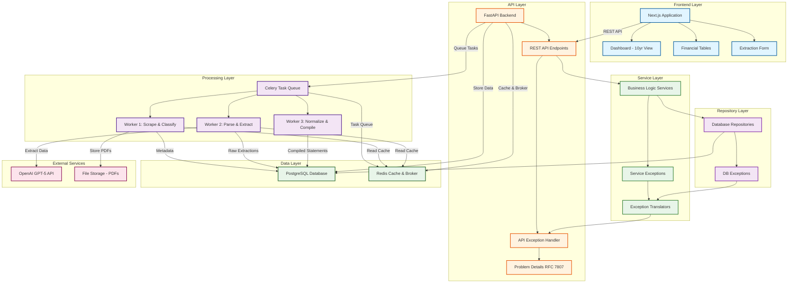

# Financial Data Extractor

An automated platform that scrapes, classifies, parses, and compiles multi-year financial statements (Income Statement, Balance Sheet, Cash Flow Statement) from European company investor relations websites.

## Project Overview

The Financial Data Extractor automates the labor-intensive process of collecting and standardizing financial data from annual reports. It handles:

- **Web Scraping**: Automated discovery and download of annual reports from investor relations websites
- **Document Classification**: Intelligent categorization of PDFs (Annual Reports, Presentations, etc.)
- **Data Extraction**: LLM-powered parsing of financial statements from PDF documents
- **Normalization**: Fuzzy matching and deduplication of line items across multiple years
- **Compilation**: Aggregation of 10 years of financial data into unified views

### Core Objectives

1. **Scrape & Classify**: Identify and categorize PDFs from investor relations websites
2. **Parse**: Extract financial data from Annual Reports using GPT-5/LLM
3. **Compile**: Aggregate 10 years of financial data into unified views
4. **Deduplicate**: Align and merge similarly-named line items across years
5. **Prioritize Latest**: Use restated data from newer reports when available

## System Architecture



## Target Companies

- **Initial Scope**: 2-3 European companies (e.g., Adyen, Heineken)
- **Hardcoded Data**: Company name, ticker, investor relations URL
- **Scalable**: Architecture supports adding more companies dynamically

## Data Flow

### Phase 1: Scraping & Classification

1. User initiates extraction for a company
2. FastAPI creates job record → sends to Celery
3. Worker 1 scrapes investor relations website
4. Identifies all PDFs (annual reports, presentations, etc.)
5. Classifies documents by type using:
   - Filename patterns
   - Document metadata
   - Content sampling
6. Stores PDFs locally or in S3-compatible storage
7. Creates database records for each PDF with metadata

### Phase 2: Parsing & Extraction

1. For each Annual Report PDF:
2. Worker 2 extracts text/tables using:
   - PyMuPDF / pdfplumber for structured tables
   - OCR (Tesseract/AWS Textract) for scanned documents
3. Sends extracted content + prompt to GPT-5:
   - "Extract Income Statement, Balance Sheet, Cash Flow Statement"
   - "Return as structured JSON with all line items"
4. GPT-5 returns structured financial data
5. Validates data structure and completeness
6. Stores raw extraction in database (JSON column)

### Phase 3: Normalization & Compilation

1. For each statement type across all years:
2. Collect all line items from all reports
3. Normalize line item names:
   - "Revenue" vs "Total Revenue" vs "Revenues"
   - Apply fuzzy matching + manual mappings
4. Detect restated data:
   - 2024 report contains 2022, 2023 data → use this over 2022, 2023 reports
5. Build unified table with 10 years of columns
6. Fill in data prioritizing latest sources
7. Store compiled view in database
8. Generate metadata:
   - Data lineage (which report each value came from)
   - Confidence scores
   - Gaps or inconsistencies

## Technology Decisions

### Why GPT-5 for Extraction?

1. **Flexibility**: Handles various report formats without custom parsers
2. **Accuracy**: State-of-the-art text understanding
3. **Hierarchy**: Understands nested line items and relationships
4. **Multi-language**: Can handle European languages

**Alternatives Considered:**

- Traditional OCR + Rule-based parsing: Too brittle
- LayoutLM/DocAI: Requires training data
- AWS Textract: Good but less flexible than GPT-5

### Why PostgreSQL?

1. **JSONB**: Perfect for storing raw extractions and metadata
2. **Relational**: Strong for company/document relationships
3. **Mature**: Excellent tooling and performance
4. **ACID**: Critical for financial data integrity

### Why Celery?

1. **Async Processing**: PDFs take minutes to process
2. **Retries**: Handle API failures, rate limits gracefully
3. **Monitoring**: Flower dashboard for task tracking
4. **Workflows**: Complex pipelines (scrape → classify → extract → compile)

See [Task Processing Documentation](infrastructure/tasks.md) for complete details on the Celery task system, Flower monitoring, and task management.

## Technology Stack

### Backend

- **FastAPI** - High-performance async web framework
- **Celery** - Distributed task queue for background processing
- **PostgreSQL** - Primary database with JSONB support
- **Redis** - Caching layer and Celery message broker
- **SQLAlchemy** - ORM for database operations
- **Alembic** - Database migrations

### Frontend

- **Next.js 15** - React framework with App Router
- **React** - UI library
- **TailwindCSS** - Utility-first CSS framework
- **shadcn/ui** - Component library

### Processing & AI

- **OpenAI GPT-5** - Financial statement extraction from PDFs
- **PyMuPDF** - PDF processing and table extraction
- **pdfplumber** - Alternative PDF text extraction
- **rapidfuzz** - Fuzzy string matching for line item normalization

## Monitoring & Observability

### Key Metrics

**Business Metrics:**

- Total companies processed
- Total PDFs classified
- Statements extracted per day
- Data quality scores

**Technical Metrics:**

- API latency (p50, p95, p99)
- Celery queue depth
- Task success/failure rates
- GPT-5 API costs and latency
- Database query performance

**Alerts:**

- Task failure rate > 5%
- GPT-5 API errors
- Queue backlog > 1000 tasks
- Disk space < 10% free

### Dashboards

**Grafana Dashboards:**

1. **Extraction Pipeline**: Jobs, phases, success rates
2. **API Performance**: Latency, throughput, errors
3. **LLM Usage**: API calls, costs, latency
4. **Infrastructure**: CPU, memory, disk, network

## Security Considerations

1. **Rate Limiting**: Prevent abuse of expensive extraction endpoints
2. **Authentication**: OAuth2 with JWT tokens
3. **API Keys**: Secure storage of OpenAI API keys (env vars)
4. **Input Validation**: Sanitize company URLs to prevent SSRF
5. **File Validation**: Verify PDFs, scan for malware
6. **Data Privacy**: GDPR compliance for European companies

## Quick Start

### Prerequisites

- Python 3.13
- UV package manager
- PostgreSQL 16+
- Redis 7+

### Initial Setup

```bash
# Clone the repository
git clone https://github.com/PatrykQuantumNomad/financial-data-extractor.git
cd financial-data-extractor

# Install backend dependencies
cd backend
make install-dev

# Run database migrations
make migrate

# Start development server
make run
```

See the [Backend README](../backend/README.md) for detailed setup instructions and development workflows.

## Documentation

This documentation site provides comprehensive guides organized by category:

### Backend

- **[Backend Overview](backend/)** - FastAPI backend architecture, database, services, and testing
  - **[Database Architecture](backend/database.md)** - Connection pool management, dependency injection, repository pattern, and exception handling
  - **[Backend Testing](backend/testing.md)** - pytest setup, unit tests, integration tests with testcontainers

### Frontend

- **[Frontend Overview](frontend/)** - Next.js 15 frontend architecture, components, React Query, and testing
  - **[Frontend Architecture](frontend/architecture.md)** - Next.js 15 architecture, React Query, components, and development guide
  - **[Frontend Testing](frontend/testing.md)** - Vitest unit testing, React Testing Library, and testing strategies
  - **[Frontend DevTools](frontend/devtools.md)** - React Query DevTools, ESLint plugin, and frontend debugging tools

### Database

- **[Database Overview](database/)** - Database schema, migrations, queries, and operations
  - **[Database Schema](database/schema.md)** - Table structures, relationships, and JSONB formats
  - **[Database Migrations](database/migrations.md)** - Alembic migration commands and workflows
  - **[Database Queries](database/queries.md)** - Useful SQL queries for data inspection

### API

- **[API Overview](api/)** - REST API documentation and reference
  - **[API Reference](api/reference.md)** - Complete REST API documentation with all endpoints, request/response formats, and examples

### Infrastructure

- **[Infrastructure Overview](infrastructure/)** - Docker setup, development environment, and task processing
  - **[Development Setup](infrastructure/development.md)** - Docker Compose setup and service management
  - **[Task Processing](infrastructure/tasks.md)** - Celery task system, workers, Flower monitoring

### Testing

- **[Testing Overview](testing/)** - Overview of testing strategies for backend and frontend

## License

Financial Data Extractor is released under the Apache 2.0 License. See the [LICENSE](https://github.com/PatrykQuantumNomad/financial-data-extractor/blob/main/LICENSE){:target="\_blank"} file for more details.
