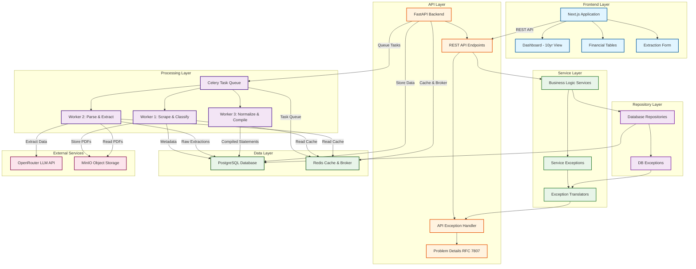

# Financial Data Extractor

An automated platform that scrapes, classifies, parses, and compiles multi-year financial statements (Income Statement, Balance Sheet, Cash Flow Statement) from European company investor relations websites.

## Project Overview

The Financial Data Extractor automates the labor-intensive process of collecting and standardizing financial data from annual reports. It handles:

- **Web Scraping**: Automated discovery and download of annual reports from investor relations websites
- **Document Classification**: Intelligent categorization of PDFs (Annual Reports, Presentations, etc.)
- **Data Extraction**: LLM-powered parsing of financial statements from PDF documents
- **Normalization**: Fuzzy matching and deduplication of line items across multiple years
- **Compilation**: Aggregation of 10 years of financial data into unified views

### Core Objectives

1. **Scrape & Classify**: Identify and categorize PDFs from investor relations websites
2. **Parse**: Extract financial data from Annual Reports using LLM (via OpenRouter)
3. **Compile**: Aggregate 10 years of financial data into unified views
4. **Deduplicate**: Align and merge similarly-named line items across years
5. **Prioritize Latest**: Use restated data from newer reports when available

## System Architecture



## Target Companies

- **Initial Scope**: 6 European companies seeded in database migrations
  - AstraZeneca PLC (AZN - LSE, NASDAQ)
  - SAP SE (SAP - XETRA, NYSE)
  - Siemens AG (SIE - XETRA)
  - ASML Holding N.V. (ASML - Euronext Amsterdam, NASDAQ)
  - Unilever PLC (ULVR - LSE, UNA - Euronext Amsterdam, UL - NYSE)
  - Allianz SE (ALV - XETRA)
- **Scalable**: Architecture supports adding more companies dynamically via API

## Data Flow

### Phase 1: Scraping & Classification

1. User initiates extraction for a company
2. FastAPI creates job record → sends to Celery
3. Worker 1 scrapes investor relations website
4. Identifies all PDFs (annual reports, presentations, etc.)
5. Classifies documents by type using:
   - Filename patterns
   - Document metadata
   - Content sampling
6. Stores PDFs in MinIO object storage
7. Creates database records for each PDF with metadata

### Phase 2: Parsing & Extraction

1. For each Annual Report PDF:
2. Worker 2 extracts text/tables using:
   - PyMuPDF / pdfplumber for structured tables
   - OCR (Tesseract/AWS Textract) for scanned documents
3. Sends extracted content + prompt to LLM (via OpenRouter):
   - "Extract Income Statement, Balance Sheet, Cash Flow Statement"
   - "Return as structured JSON with all line items"
4. LLM returns structured financial data
5. Validates data structure and completeness
6. Stores raw extraction in database (JSON column)

### Phase 3: Normalization & Compilation

1. For each statement type across all years:
2. Collect all line items from all reports
3. Normalize line item names:
   - "Revenue" vs "Total Revenue" vs "Revenues"
   - Apply fuzzy matching + manual mappings
4. Detect restated data:
   - 2024 report contains 2022, 2023 data → use this over 2022, 2023 reports
5. Build unified table with 10 years of columns
6. Fill in data prioritizing latest sources
7. Store compiled view in database
8. Generate metadata:
   - Data lineage (which report each value came from)
   - Confidence scores
   - Gaps or inconsistencies

## Technology Decisions

### Why LLM for Extraction?

The platform uses **OpenRouter** as an API gateway to access multiple LLM providers (OpenAI, Anthropic, etc.), allowing flexible model selection:

1. **Flexibility**: Handles various report formats without custom parsers
2. **Accuracy**: State-of-the-art text understanding from multiple providers
3. **Hierarchy**: Understands nested line items and relationships
4. **Multi-language**: Can handle European languages
5. **Model Selection**: Choose optimal models per task (e.g., GPT-4o-mini for scraping, GPT-4o for extraction)

**Configuration:**

- **Scraping Model**: `openai/gpt-4o-mini` (fast, cost-effective for URL discovery)
- **Extraction Model**: `openai/gpt-4o-mini` (configurable, can use GPT-4o or Claude 3.5 Sonnet for better accuracy)
- **API Gateway**: OpenRouter provides unified interface to multiple providers

**Alternatives Considered:**

- Traditional OCR + Rule-based parsing: Too brittle
- LayoutLM/DocAI: Requires training data
- AWS Textract: Good but less flexible than modern LLMs
- Direct OpenAI API: OpenRouter provides better flexibility and cost management

### Why PostgreSQL?

1. **JSONB**: Perfect for storing raw extractions and metadata
2. **Relational**: Strong for company/document relationships
3. **Mature**: Excellent tooling and performance
4. **ACID**: Critical for financial data integrity

### Why Celery?

1. **Async Processing**: PDFs take minutes to process, LLM calls can take 2-5 minutes per document
2. **Retries**: Handle API failures, rate limits gracefully with exponential backoff
3. **Monitoring**: Flower dashboard for real-time task tracking and history
4. **Workflows**: Complex pipelines (scrape → classify → extract → compile) with task chaining
5. **Queue Management**: Dedicated queues for different task types (scraping, extraction, compilation, orchestration)
6. **Scalability**: Horizontal scaling with multiple workers across queues

See [Task Processing Documentation](infrastructure/tasks.md) for complete details on the Celery task system, Flower monitoring, and task management.

## Technology Stack

### Backend

- **FastAPI** - High-performance async web framework
- **Celery** - Distributed task queue for background processing
- **PostgreSQL** - Primary database with JSONB support
- **Redis** - Caching layer and Celery message broker
- **SQLAlchemy** - ORM for database operations
- **Alembic** - Database migrations

### Frontend

- **Next.js 15** - React framework with App Router
- **React** - UI library
- **TailwindCSS** - Utility-first CSS framework
- **shadcn/ui** - Component library

### Processing & AI

- **OpenRouter** - LLM API gateway for accessing multiple models (GPT-4o, GPT-4o-mini, Claude 3.5 Sonnet)
- **PyMuPDF** - PDF processing and table extraction
- **pdfplumber** - Alternative PDF text extraction
- **rapidfuzz** - Fuzzy string matching for line item normalization
- **Crawl4AI** - LLM-friendly web crawler for investor relations websites

## Monitoring & Observability

The platform includes a comprehensive observability stack for monitoring, metrics, and logging:

### Monitoring Stack

- **Prometheus** - Metrics collection and storage (port 9090)
- **Grafana** - Metrics visualization and dashboards (port 3200)
- **Loki** - Log aggregation (port 3100)
- **Promtail** - Log shipper for container logs
- **Flower** - Celery task monitoring (port 5555)
- **PostgreSQL Exporter** - Database metrics (port 9187)
- **Redis Exporter** - Cache and broker metrics (port 9121)

### Key Metrics

**Business Metrics:**

- Total companies processed
- Total PDFs classified
- Statements extracted per day
- Data quality scores
- Extraction success rates

**Technical Metrics:**

- API latency (p50, p95, p99) - via Prometheus from FastAPI `/metrics`
- Celery queue depth - monitored via Flower and Redis exporter
- Task success/failure rates - tracked in Flower and Prometheus
- LLM API costs and latency - tracked via custom metrics
- Database query performance - PostgreSQL exporter metrics
- Redis connection pool usage - Redis exporter metrics
- Storage usage (MinIO) - via MinIO console

**Alerts:**

- Task failure rate > 5%
- LLM API errors (429, 500, timeout)
- Queue backlog > 1000 tasks
- Database connection pool exhaustion
- Redis memory usage > 80%
- Disk space < 10% free

### Dashboards

**Grafana Dashboards (Pre-configured):**

1. **API Performance** - Request latency, throughput, error rates from FastAPI
2. **Database Metrics** - PostgreSQL connection pool, query performance, transaction rates
3. **Redis Metrics** - Memory usage, connection count, command rates
4. **Celery Tasks** - Task execution times, success/failure rates, queue depths (via Prometheus)
5. **Infrastructure** - CPU, memory, disk, network usage

**Log Aggregation:**

- All container logs aggregated via Promtail → Loki
- Query logs via Grafana Explore view
- Structured logging from FastAPI with request IDs
- Celery worker logs with task context

### Access

- **Grafana**: `http://localhost:3200` (admin/admin)
- **Prometheus**: `http://localhost:9090`
- **Flower**: `http://localhost:5555`
- **Loki**: `http://localhost:3100`

## Security Considerations

1. **Rate Limiting**: Prevent abuse of expensive extraction endpoints
2. **Authentication**: OAuth2 with JWT tokens
3. **API Keys**: Secure storage of OpenRouter API keys (env vars)
4. **Input Validation**: Sanitize company URLs to prevent SSRF
5. **File Validation**: Verify PDFs, scan for malware
6. **Data Privacy**: GDPR compliance for European companies

## Quick Start

### Prerequisites

- **Python 3.13** - Backend runtime
- **UV package manager** - Python dependency management
- **Node.js 18+** - Frontend runtime
- **Docker & Docker Compose** - Infrastructure services
- **PostgreSQL 16+** - Primary database (via Docker)
- **Redis 8+** - Cache and Celery broker (via Docker)
- **MinIO** - Object storage for PDFs (via Docker)
- **OpenRouter API Key** - For LLM access (get from [OpenRouter.ai](https://openrouter.ai))

### Initial Setup

```bash
# Clone the repository
git clone https://github.com/PatrykQuantumNomad/financial-data-extractor.git
cd financial-data-extractor

# Start infrastructure services (PostgreSQL, Redis, MinIO, monitoring)
cd infrastructure
make up-dev

# Setup backend
cd ../backend
make install-dev
make migrate

# Start backend server (in one terminal)
make run

# Start Celery worker (in another terminal)
make celery-worker

# Setup frontend (in a third terminal)
cd ../frontend
npm install
npm run dev
```

**Access Points:**

- **Frontend**: `http://localhost:3000`
- **Backend API**: `http://localhost:3030`
- **API Docs**: `http://localhost:3030/docs`
- **Grafana**: `http://localhost:3200`
- **Flower**: `http://localhost:5555`
- **MinIO Console**: `http://localhost:9001`

See the [Infrastructure Development Setup](infrastructure/development.md) and [Backend README](../backend/README.md) for detailed setup instructions.

## Documentation

This documentation site provides comprehensive guides organized by category:

### Backend

- **[Backend Overview](backend/)** - FastAPI backend architecture, database, services, and testing
  - **[Database Architecture](backend/database.md)** - Connection pool management, dependency injection, repository pattern, and exception handling
  - **[Backend Testing](backend/testing.md)** - pytest setup, unit tests, integration tests with testcontainers

### Frontend

- **[Frontend Overview](frontend/)** - Next.js 15 frontend architecture, components, React Query, and testing
  - **[Frontend Architecture](frontend/architecture.md)** - Next.js 15 architecture, React Query, components, and development guide
  - **[Frontend Testing](frontend/testing.md)** - Vitest unit testing, React Testing Library, and testing strategies
  - **[Frontend DevTools](frontend/devtools.md)** - React Query DevTools, ESLint plugin, and frontend debugging tools

### Database

- **[Database Overview](database/)** - Database schema, migrations, queries, and operations
  - **[Database Schema](database/schema.md)** - Table structures, relationships, and JSONB formats
  - **[Database Migrations](database/migrations.md)** - Alembic migration commands and workflows
  - **[Database Queries](database/queries.md)** - Useful SQL queries for data inspection

### API

- **[API Overview](api/)** - REST API documentation and reference
  - **[API Reference](api/reference.md)** - Complete REST API documentation with all endpoints, request/response formats, and examples

### Infrastructure

- **[Infrastructure Overview](infrastructure/)** - Docker setup, development environment, and task processing
- **[Development Setup](infrastructure/development.md)** - Docker Compose setup, service management, and monitoring stack
- **[Task Processing](infrastructure/tasks.md)** - Celery task system, workers, Flower monitoring
- **[Object Storage](storage.md)** - MinIO object storage setup and usage

### Testing

- **[Testing Overview](testing/)** - Overview of testing strategies for backend and frontend

## License

Financial Data Extractor is released under the Apache 2.0 License. See the [LICENSE](https://github.com/PatrykQuantumNomad/financial-data-extractor/blob/main/LICENSE){:target="\_blank"} file for more details.
