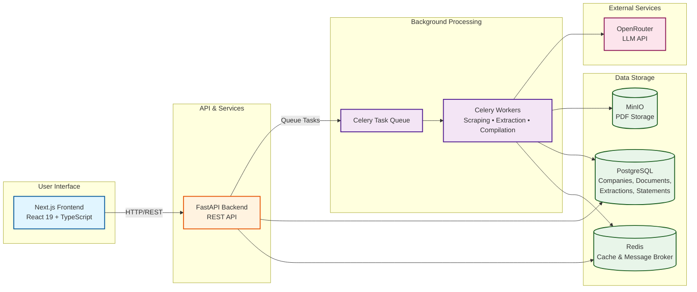

# Financial Data Extractor

An automated platform that scrapes, classifies, parses, and compiles multi-year financial statements (Income Statement, Balance Sheet, Cash Flow Statement) from European company investor relations websites.

## Project Overview

The Financial Data Extractor automates the labor-intensive process of collecting and standardizing financial data from annual reports. It handles:

- **Web Scraping**: Automated discovery and download of annual reports from investor relations websites
- **Document Classification**: Intelligent categorization of PDFs (Annual Reports, Presentations, etc.)
- **Data Extraction**: LLM-powered parsing of financial statements from PDF documents
- **Normalization**: Fuzzy matching and deduplication of line items across multiple years
- **Compilation**: Aggregation of 10 years of financial data into unified views

### Core Objectives

1. **Scrape & Classify**: Identify and categorize PDFs from investor relations websites
2. **Parse**: Extract financial data from Annual Reports using LLM (via OpenRouter)
3. **Compile**: Aggregate 10 years of financial data into unified views
4. **Deduplicate**: Align and merge similarly-named line items across years
5. **Prioritize Latest**: Use restated data from newer reports when available

## System Architecture

The Financial Data Extractor follows a modern, layered architecture with clear separation between frontend, API, processing, and data layers:

**Key Components:**

- **Frontend**: Next.js 15 application providing user interface and data visualization
- **Backend API**: FastAPI REST API handling requests and business logic
- **Task Processing**: Celery workers for async operations (scraping, extraction, compilation)
- **Data Layer**: PostgreSQL for structured data, Redis for caching, MinIO for file storage
- **LLM Integration**: OpenRouter API gateway for flexible model selection

For detailed architecture information, see the **[Architecture Overview](architecture/)** documentation.

## Target Companies

- **Initial Scope**: 6 European companies seeded in database migrations
  - AstraZeneca PLC (AZN - LSE, NASDAQ)
  - SAP SE (SAP - XETRA, NYSE)
  - Siemens AG (SIE - XETRA)
  - ASML Holding N.V. (ASML - Euronext Amsterdam, NASDAQ)
  - Unilever PLC (ULVR - LSE, UNA - Euronext Amsterdam, UL - NYSE)
  - Allianz SE (ALV - XETRA)
- **Scalable**: Architecture supports adding more companies dynamically via API

## Data Flow

The system processes financial data through three main phases:

1. **Scraping & Classification** - Discover and categorize PDFs from investor relations websites
2. **Parsing & Extraction** - Extract financial statements using LLM
3. **Normalization & Compilation** - Normalize and compile 10 years of data

See the **[Data Flow documentation](architecture/data-flow.html)** for detailed workflow information.

## Technology Decisions

Key technology choices include:

- **OpenRouter** - LLM API gateway for flexible model selection
- **PostgreSQL** - JSONB support for flexible data structures
- **Celery** - Distributed task queue for async processing
- **FastAPI** - High-performance async API framework
- **Next.js 15** - Modern React framework with Server Components
- **React Query** - Data fetching and caching
- **MinIO** - S3-compatible object storage

See the **[Technology Decisions documentation](architecture/technology-decisions.html)** for detailed rationale behind each choice.

## Technology Stack

### Backend

- **FastAPI** - High-performance async web framework
- **Celery** - Distributed task queue for background processing
- **PostgreSQL** - Primary database with JSONB support
- **Redis** - Caching layer and Celery message broker
- **SQLAlchemy** - ORM for database operations
- **Alembic** - Database migrations

### Frontend

- **Next.js 15** - React framework with App Router
- **React** - UI library
- **TailwindCSS** - Utility-first CSS framework
- **shadcn/ui** - Component library

### Processing & AI

- **OpenRouter** - LLM API gateway for accessing multiple models (GPT-4o, GPT-4o-mini, Claude 3.5 Sonnet)
- **PyMuPDF** - PDF processing and table extraction
- **pdfplumber** - Alternative PDF text extraction
- **rapidfuzz** - Fuzzy string matching for line item normalization
- **Crawl4AI** - LLM-friendly web crawler for investor relations websites

## Monitoring & Observability

The platform includes a comprehensive observability stack for monitoring, metrics, and logging:

### Monitoring Stack

- **Prometheus** - Metrics collection and storage (port 9090)
- **Grafana** - Metrics visualization and dashboards (port 3200)
- **Loki** - Log aggregation (port 3100)
- **Promtail** - Log shipper for container logs
- **Flower** - Celery task monitoring (port 5555)
- **PostgreSQL Exporter** - Database metrics (port 9187)
- **Redis Exporter** - Cache and broker metrics (port 9121)

### Key Metrics

**Business Metrics:**

- Total companies processed
- Total PDFs classified
- Statements extracted per day
- Data quality scores
- Extraction success rates

**Technical Metrics:**

- API latency (p50, p95, p99) - via Prometheus from FastAPI `/metrics`
- Celery queue depth - monitored via Flower and Redis exporter
- Task success/failure rates - tracked in Flower and Prometheus
- LLM API costs and latency - tracked via custom metrics
- Database query performance - PostgreSQL exporter metrics
- Redis connection pool usage - Redis exporter metrics
- Storage usage (MinIO) - via MinIO console

**Alerts:**

- Task failure rate > 5%
- LLM API errors (429, 500, timeout)
- Queue backlog > 1000 tasks
- Database connection pool exhaustion
- Redis memory usage > 80%
- Disk space < 10% free

### Dashboards

**Grafana Dashboards (Pre-configured):**

1. **API Performance** - Request latency, throughput, error rates from FastAPI
2. **Database Metrics** - PostgreSQL connection pool, query performance, transaction rates
3. **Redis Metrics** - Memory usage, connection count, command rates
4. **Celery Tasks** - Task execution times, success/failure rates, queue depths (via Prometheus)
5. **Infrastructure** - CPU, memory, disk, network usage

**Log Aggregation:**

- All container logs aggregated via Promtail → Loki
- Query logs via Grafana Explore view
- Structured logging from FastAPI with request IDs
- Celery worker logs with task context

### Access

- **Grafana**: `http://localhost:3200` (admin/admin)
- **Prometheus**: `http://localhost:9090`
- **Flower**: `http://localhost:5555`
- **Loki**: `http://localhost:3100`

## Security Considerations

1. **Rate Limiting**: Prevent abuse of expensive extraction endpoints
2. **Authentication**: OAuth2 with JWT tokens
3. **API Keys**: Secure storage of OpenRouter API keys (env vars)
4. **Input Validation**: Sanitize company URLs to prevent SSRF
5. **File Validation**: Verify PDFs, scan for malware
6. **Data Privacy**: GDPR compliance for European companies

## Quick Start

Get started quickly with the **[Getting Started Guide](getting-started/)** which includes:

- **[Installation](getting-started/installation.html)** - Complete setup instructions
- **[First Steps](getting-started/first-steps.html)** - Tutorial for your first extraction

For detailed setup information, see the [Infrastructure Development Setup](infrastructure/development.html).

## Documentation

This documentation site provides comprehensive guides organized by category:

### Getting Started

- **[Getting Started Guide](getting-started/)** - Quick start and installation
  - **[Installation](getting-started/installation.html)** - Detailed setup instructions
  - **[First Steps](getting-started/first-steps.html)** - Tutorial for your first extraction

### Architecture

- **[Architecture Overview](architecture/)** - System design and architecture
  - **[Data Flow](architecture/data-flow.html)** - Detailed workflow from scraping to compilation
  - **[Technology Decisions](architecture/technology-decisions.html)** - Rationale behind technology choices

### Backend

- **[Backend Overview](backend/)** - FastAPI backend architecture, database, services, and testing
  - **[Backend Architecture](backend/architecture.html)** - Connection pool management, dependency injection, repository pattern, and exception handling
  - **[Backend Testing](testing/backend.html)** - pytest setup, unit tests, integration tests with testcontainers

### Frontend

- **[Frontend Overview](frontend/)** - Next.js 15 frontend architecture, components, React Query, and testing
  - **[Frontend Architecture](frontend/architecture.html)** - Next.js 15 architecture, React Query, components, and development guide
  - **[Frontend Testing](testing/frontend.html)** - Vitest unit testing, React Testing Library, and testing strategies
  - **[Frontend DevTools](frontend/devtools.html)** - React Query DevTools, ESLint plugin, and frontend debugging tools

### API

- **[API Overview](api/)** - REST API documentation and reference
  - **[API Reference](api/reference.html)** - Complete REST API documentation with all endpoints, request/response formats, and examples

### Database

- **[Database Overview](database/)** - Database schema, migrations, queries, and operations
  - **[Database Schema](database/schema.html)** - Table structures, relationships, and JSONB formats
  - **[Database Migrations](database/migrations.html)** - Alembic migration commands and workflows
  - **[Database Queries](database/queries.html)** - Useful SQL queries for data inspection

### Infrastructure

- **[Infrastructure Overview](infrastructure/)** - Docker setup, development environment, and task processing
  - **[Development Setup](infrastructure/development.html)** - Docker Compose setup, service management, and monitoring stack
  - **[Task Processing](infrastructure/tasks.html)** - Celery task system, workers, Flower monitoring
  - **[Object Storage](infrastructure/storage.html)** - MinIO object storage setup and usage

### Testing

- **[Testing Overview](testing/)** - Overview of testing strategies for backend and frontend
  - **[Backend Testing](testing/backend.html)** - pytest guide for FastAPI backend
  - **[Frontend Testing](testing/frontend.html)** - Vitest guide for Next.js frontend

### Development Tools

- **[Development Tools](development/)** - IDE configuration and development environment
  - **[Cursor IDE Configuration](development/cursor-ide.html)** - Cursor rules, VS Code settings, debug configurations, and tasks

## License

Financial Data Extractor is released under the Apache 2.0 License. See the [LICENSE](https://github.com/PatrykQuantumNomad/financial-data-extractor/blob/main/LICENSE){:target="\_blank"} file for more details.
