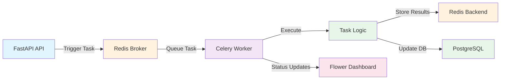

# Task Processing with Celery

The Financial Data Extractor uses **Celery** with **Redis** as a message broker to handle long-running asynchronous tasks for web scraping, PDF processing, and financial data extraction.

## Overview

Celery tasks enable the system to process time-consuming operations asynchronously:

- **Web Scraping**: Discover PDFs from investor relations websites (seconds to minutes)
- **PDF Download**: Download and store PDF documents (seconds to minutes)
- **Document Classification**: Classify documents by type (seconds)
- **Financial Extraction**: Extract statements using LLM (2-5 minutes per PDF)
- **Data Compilation**: Normalize and compile multi-year statements (minutes)

## Architecture



## Task Queues

Tasks are organized into dedicated queues for better resource management:

| Queue           | Purpose                          | Typical Duration     | Concurrency  |
| --------------- | -------------------------------- | -------------------- | ------------ |
| `scraping`      | Web scraping and URL discovery   | Seconds to 1 minute  | High (5-10)  |
| `extraction`    | LLM-powered financial extraction | 2-5 minutes          | Low (1-2)    |
| `compilation`   | Normalization and compilation    | 30s - 2 minutes      | Medium (2-3) |
| `orchestration` | End-to-end workflows             | 10 minutes - 2 hours | Low (1)      |
| `default`       | General tasks                    | Varies               | Medium (2-3) |

## Available Tasks

### Company-Level Tasks

#### `extract_company_financial_data`

**Complete end-to-end extraction workflow for a company.**

Triggers the full pipeline:

1. Scrapes investor relations website
2. Discovers and classifies documents
3. Downloads PDFs
4. Extracts financial statements
5. Normalizes and compiles statements

**API Endpoint:**

```http
POST /api/v1/tasks/companies/{company_id}/extract
```

**Example:**

```bash
curl -X POST http://localhost:3000/api/v1/tasks/companies/1/extract
```

**Response:**

```json
{
  "task_id": "a00d8c65-c7fd-4360-8f4c-836b0df25f59",
  "status": "PENDING",
  "message": "Financial data extraction started for company 1"
}
```

**Estimated Duration:** 10 minutes - 2 hours (depends on number of documents)

---

#### `scrape_investor_relations`

**Scrape investor relations website to discover PDF documents.**

**API Endpoint:**

```http
POST /api/v1/tasks/companies/{company_id}/scrape
```

**Returns:** List of discovered document URLs with metadata

**Estimated Duration:** 30 seconds - 5 minutes

---

#### `recompile_company_statements`

**Recompile all financial statements after new extractions.**

Useful when new documents are processed and statements need updating.

**API Endpoint:**

```http
POST /api/v1/tasks/companies/{company_id}/recompile
```

**Estimated Duration:** 1-5 minutes

---

### Document-Level Tasks

#### `process_document`

**Process a document end-to-end: classify, download, and extract.**

Convenience task that orchestrates:

1. Document classification
2. PDF download (if needed)
3. Financial statement extraction (for annual reports)

**API Endpoint:**

```http
POST /api/v1/tasks/documents/{document_id}/process
```

**Estimated Duration:** 2-10 minutes

---

#### `download_pdf`

**Download PDF document from URL and store locally.**

**API Endpoint:**

```http
POST /api/v1/tasks/documents/{document_id}/download
```

**Returns:** File path and SHA256 hash

**Estimated Duration:** 5-30 seconds

---

#### `classify_document`

**Classify document by type (annual_report, quarterly_report, etc.).**

Uses filename patterns, URL patterns, and content analysis.

**API Endpoint:**

```http
POST /api/v1/tasks/documents/{document_id}/classify
```

**Estimated Duration:** 1-5 seconds

---

#### `extract_financial_statements`

**Extract financial statements from PDF using LLM.**

Extracts Income Statement, Balance Sheet, and Cash Flow Statement.

**API Endpoint:**

```http
POST /api/v1/tasks/documents/{document_id}/extract
```

**Returns:** Extracted statement data in JSON format

**Estimated Duration:** 2-5 minutes per document

---

### Task Status

#### `get_task_status`

**Check the current status and result of a Celery task.**

**API Endpoint:**

```http
GET /api/v1/tasks/{task_id}
```

**Response:**

```json
{
  "task_id": "a00d8c65-c7fd-4360-8f4c-836b0df25f59",
  "status": "SUCCESS",
  "result": {
    "task_id": "...",
    "company_id": 1,
    "status": "success",
    "discovered_count": 12,
    "created_count": 12
  },
  "error": null
}
```

**Status Values:**

- `PENDING` - Task is waiting to be processed
- `STARTED` - Task has started execution
- `PROGRESS` - Task is in progress (check `meta` for details)
- `SUCCESS` - Task completed successfully
- `FAILURE` - Task failed (check `error` field)
- `RETRY` - Task is being retried
- `REVOKED` - Task was cancelled

---

## Running Celery Workers

### Starting Workers

```bash
# Start worker listening to all queues
make celery-worker

# Or manually with specific queues
celery -A app.tasks.celery_app worker \
  --loglevel=info \
  -Q scraping,extraction,compilation,orchestration,default
```

### Worker Configuration

Workers are configured with:

- **Prefetch multiplier:** 1 (better load balancing)
- **Max tasks per child:** 1000 (prevents memory leaks)
- **Late acknowledgment:** Tasks acknowledged after completion
- **Task time limits:** Soft and hard limits per task type
- **Auto-retry:** Configured per task with exponential backoff

### Worker Logs

Worker logs include:

- Task start/completion
- Progress updates (via `update_state()`)
- Errors and retry attempts
- Performance metrics

**Log Format:**

```
2025-01-15 10:30:45 [INFO] app.tasks.scraping_tasks: Starting scrape_investor_relations task
2025-01-15 10:30:45 [INFO] app.tasks.scraping_tasks: Scraping IR website: https://...
```

---

## Flower Monitoring Dashboard

**Flower** provides a real-time web-based dashboard for monitoring Celery clusters.

### Starting Flower

```bash
make celery-flower
```

**Access:** http://localhost:5555

### Flower Features

#### Workers Tab

- View all active workers
- Monitor worker status (online/offline)
- Track worker metrics:
  - Active tasks
  - Processed/Failed/Succeeded counts
  - System load average
  - Worker uptime

#### Tasks Tab

- View all tasks across states:
  - **Active** - Currently executing
  - **Scheduled** - Waiting to start
  - **Reserved** - Reserved by workers
  - **Succeeded** - Completed successfully
  - **Failed** - Failed tasks
  - **Revoked** - Cancelled tasks
- Search tasks by name or ID
- Filter by worker, state, or time range
- View task details:
  - Arguments and keyword arguments
  - Result data
  - Traceback (for failed tasks)
  - Execution timeline
  - Worker assignment

#### Task Actions

- **Retry** - Retry failed tasks
- **Revoke** - Cancel pending/running tasks
- **Terminate** - Force terminate running tasks
- **View Traceback** - See full error details

#### Broker Tab

- Monitor Redis broker status
- View queue depths
- Check message rates

### Persistent Task History

Flower runs with `--persistent=True` to maintain task history in a local SQLite database. This allows you to:

- View completed tasks even after they're removed from Redis
- Track task history over time
- Analyze task performance

**Note:** Flower database files (`flower`, `flower-shm`, `flower-wal`) are git-ignored.

---

## Task Execution Workflow

### Step-by-Step: Extracting Financial Data for a Company

1. **Trigger Extraction**

   ```bash
   curl -X POST http://localhost:3000/api/v1/tasks/companies/1/extract
   ```

   Returns: `task_id`

2. **Monitor in Flower**

   - Open http://localhost:3000:5555
   - Navigate to "Tasks" tab
   - Search for your `task_id`
   - Watch task progress through states:
     - `PENDING` → `STARTED` → `PROGRESS` → `SUCCESS`

3. **Check Status via API**

   ```bash
   curl http://localhost:3000/api/v1/tasks/{task_id}
   ```

4. **View Results**
   - Check Flower dashboard for detailed execution timeline
   - Use API status endpoint for JSON response
   - Review worker logs for detailed execution logs

### Task State Updates

Tasks report progress using `update_state()`:

```python
self.update_state(
    state="PROGRESS",
    meta={"step": "scraping_website", "progress": 30}
)
```

**Progress States:**

- `fetching_company_info` - Retrieving company data
- `scraping_website` - Discovering PDFs
- `creating_document_records` - Creating database entries
- `downloading_file` - Downloading PDF
- `classifying` - Classifying document type
- `processing_pdf` - Extracting text/tables
- `calling_llm` - Calling OpenAI API
- `storing_extractions` - Saving extraction results
- `normalizing_line_items` - Normalizing financial data
- `compiling_statement` - Compiling multi-year statement

---

## Error Handling & Retries

### Automatic Retries

Tasks are configured with automatic retries for transient failures:

- **Max Retries:** 2-3 attempts (configurable per task)
- **Retry Delay:** Exponential backoff (60-300 seconds)
- **Retry Conditions:**
  - Network errors (ConnectionError, TimeoutException)
  - HTTP errors (5xx server errors)
  - Rate limiting (429 errors)

### Retry Logic

```python
@celery_app.task(
    max_retries=3,
    default_retry_delay=60,
    autoretry_for=(httpx.HTTPError, httpx.TimeoutException),
)
```

Tasks automatically retry on specified exceptions without manual intervention.

### Handling Persistent Failures

**403 Forbidden (Website Blocking):**

- Tasks handle 403 gracefully
- Return "partial" status with empty results
- Do not retry (retrying won't help)

**Other Failures:**

- Tasks retry up to `max_retries` times
- After final failure, task marked as `FAILURE`
- Full traceback available in Flower and logs

---

## Testing Tasks

### Using the Test Script

A convenient bash script is provided for testing tasks:

```bash
# Show help
./scripts/test_tasks.sh help

# Trigger scraping task
./scripts/test_tasks.sh company-scrape 1

# Trigger with auto-polling
POLL=true ./scripts/test_tasks.sh company-scrape 1

# Check task status
./scripts/test_tasks.sh status {task_id}

# Poll until completion
./scripts/test_tasks.sh poll {task_id} 600
```

### Using Makefile

```bash
# Trigger a task
make test-task COMMAND="company-scrape 1"

# Trigger with auto-polling
make test-task-poll COMMAND="company-scrape 1"
```

See [Testing Tasks](#testing-tasks) section for full details.

---

## Task Configuration

### Task Limits

| Task Type     | Soft Limit   | Hard Limit | Max Retries |
| ------------- | ------------ | ---------- | ----------- |
| Scraping      | 5 minutes    | 10 minutes | 3           |
| Extraction    | 27.5 minutes | 30 minutes | 3           |
| Compilation   | 27.5 minutes | 30 minutes | 2           |
| Orchestration | 1h 55min     | 2 hours    | 2           |

### Result Expiration

- Task results expire after **1 hour** in Redis
- Use Flower's persistent mode to view older tasks
- Results can be retrieved via API within expiration window

### Task Serialization

- All tasks use **JSON serialization**
- Results stored in Redis backend
- Supports complex nested data structures

---

## Best Practices

### Monitoring

1. **Start Flower** before triggering tasks
2. **Watch worker logs** for real-time execution details
3. **Monitor queue depths** in Flower Broker tab
4. **Set up alerts** for task failure rates > 5%

### Performance

1. **Use appropriate queues** - Route tasks to specialized workers
2. **Monitor worker load** - Add workers if queues backlog
3. **Optimize retry delays** - Balance retry speed vs. resource usage
4. **Cache LLM responses** - Avoid reprocessing same documents

### Error Handling

1. **Check task status** after triggering
2. **Review Flower tracebacks** for failed tasks
3. **Implement circuit breakers** for external services
4. **Log all critical operations** with structured context

### Development

1. **Test tasks individually** before running full workflows
2. **Use test script** for consistent testing
3. **Monitor Flower** during development
4. **Review worker logs** for debugging

---

## Troubleshooting

### Tasks Not Appearing in Flower

**Solution:**

- Ensure worker is listening to correct queues
- Restart Flower with `--persistent=True`
- Check Redis connection

### Tasks Stuck in PENDING

**Possible Causes:**

- No worker listening to task's queue
- Worker crashed or offline
- Redis connection issues

**Solution:**

- Verify worker is running: `make celery-worker`
- Check worker logs for errors
- Verify Redis is accessible

### High Task Failure Rate

**Check:**

- Worker logs for error patterns
- External service status (OpenAI API, websites)
- Database connection pool health
- Resource constraints (memory, CPU)

### Slow Task Execution

**Optimize:**

- Increase worker concurrency
- Add more workers
- Optimize database queries
- Cache expensive operations

---

## Additional Resources

- [Celery Documentation](https://docs.celeryq.dev/)
- [Flower Documentation](https://flower.readthedocs.io/)
- [Redis Documentation](https://redis.io/docs/)
- [Task API Reference](../api-reference.md#tasks)
